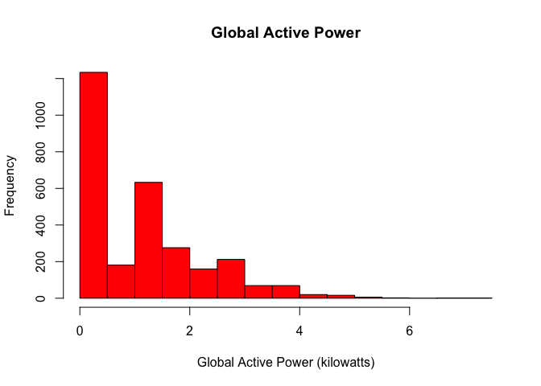
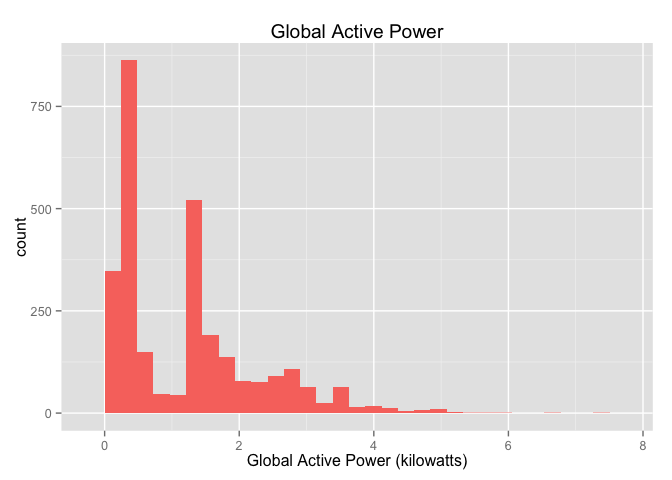
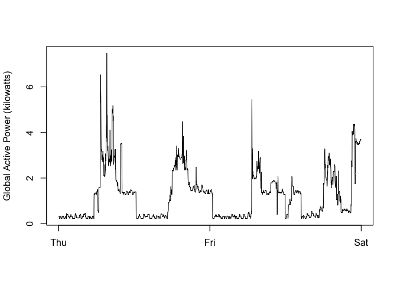
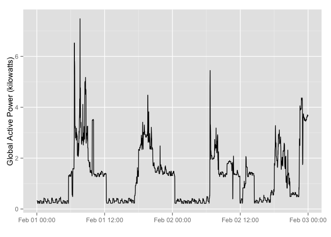
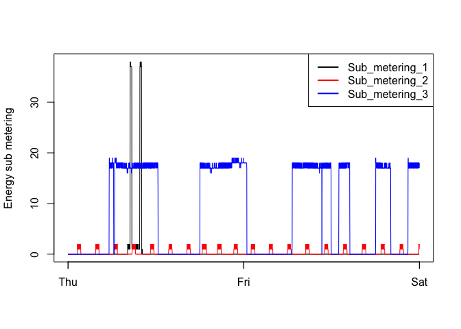
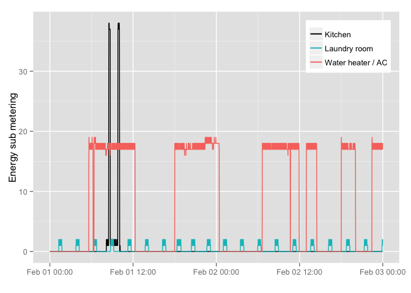
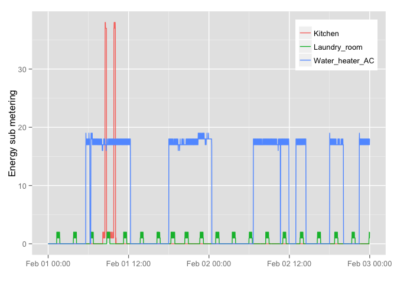
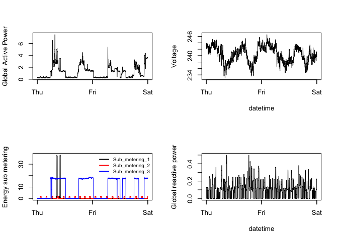
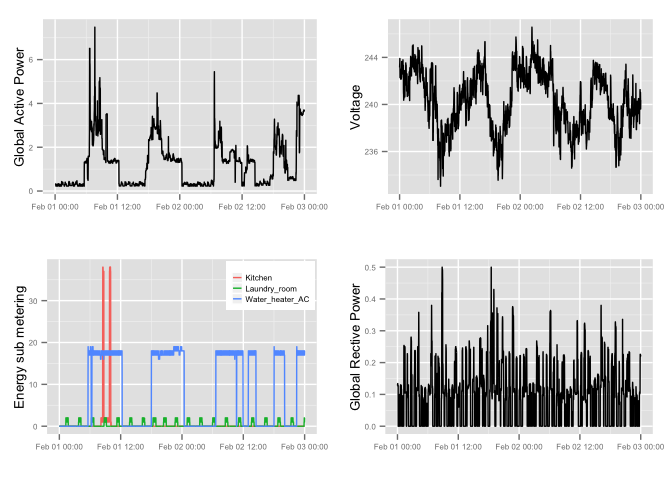

# Electric Power Consumption
*Jeffrey Hallock*  

This document is an expansion of an R script written for Project 1 of the
Coursera course "Exploratory Data Analysis" from Johns Hopkins University.

The purpose of this program is to load the "Individual household electric power consumption Data Set", part of the [UC Irvine Machine Learning Repository](http://archive.ics.uci.edu/ml/), and reproduce a specific set of plots displaying data collected over the 2-day period Febuary 1st through Febuary 2nd, 2007. Plots are made using both the base plotting system and using ggplot2.

The following descriptions of the 9 variables in the dataset are taken from the [UCI web site](https://archive.ics.uci.edu/ml/datasets/Individual+household+electric+power+consumption):

1. **Date**: Date in format dd/mm/yyyy
2. **Time**: time in format hh:mm:ss
3. **Global_active_power**: household global minute-averaged active power (in kilowatt)
4. **Global_reactive_power**: household global minute-averaged reactive power (in kilowatt)
5. **Voltage**: minute-averaged voltage (in volt)
6. **Global_intensity**: household global minute-averaged current intensity (in ampere)
7. **Sub_metering_1**: energy sub-metering No. 1 (in watt-hour of active energy). It corresponds to the kitchen, containing mainly a dishwasher, an oven and a microwave (hot plates are not electric but gas powered).
8. **Sub_metering_2**: energy sub-metering No. 2 (in watt-hour of active energy). It corresponds to the laundry room, containing a washing-machine, a tumble-drier, a refrigerator and a light.
9. **Sub_metering_3**: energy sub-metering No. 3 (in watt-hour of active energy). It corresponds to an electric water-heater and an air-conditioner.


```r
library(dplyr)
library(ggplot2)
library(reshape2)
library(gridExtra)
library(grid)
```

##  Part 1: Load the data

The data can be downloaded from a url in the form of a zip file. The progam checks for the three conditions:

1. The file has already been downloaded and unzipped
2. The file has been downloaded but has not been unzipped
3. The file has not been downloaded


```r
if(file.exists("household_power_consumption.txt")) {
    data0 <- read.table("household_power_consumption.txt",
                        sep = ";", header = TRUE, stringsAsFactors = FALSE)
} else if(file.exists("exdata-data-household_power_consumption.zip")) {
    data0 <- read.table(unz("exdata-data-household_power_consumption.zip",
                            "household_power_consumption.txt"),
                        sep = ";", header = TRUE, stringsAsFactors = FALSE)
} else {
    temp <- tempfile()
    download.file("https://archive.ics.uci.edu/ml/machine-learning-databases/00235/household_power_consumption.zip",temp)
    data <- read.table(unz(temp, "household_power_consumption.txt"),
                       sep = ";", header = TRUE, stringsAsFactors = FALSE)
    unlink(temp)
}
```


##  Part 2: Format data


The program converts the data to a tbl_df object to allow manipulation with dplyr functions. The two days of interest are subsetted out, and the data and time variables are combined into a POSIXlt object.


```r
data0 <- tbl_df(data0)
dataFil <- filter(data0, Date == "2/2/2007" | Date == "1/2/2007")
dataFil <- mutate(dataFil, Date_Time = paste(Date, Time, sep = " "))
dataFil$Date_Time <- strptime(dataFil$Date_Time, "%d/%m/%Y %H:%M:%S")
dataFil[, 3:9] <- lapply(dataFil[, 3:9], as.numeric)
dataFil <- dataFil[, c(10, 3:9)]
dataFil <- rename(dataFil, Kitchen = Sub_metering_1,
                  Laundry_room = Sub_metering_2, Water_heater_AC = Sub_metering_3)
```


##  Part 3: Make exploratory plots


### Plot 1

```r
hist(dataFil$Global_active_power, col = "red",
     xlab = "Global Active Power (kilowatts)", main = "Global Active Power")
```

 

```r
g1 <- (ggplot(dataFil, aes(x = Global_active_power))
       + geom_histogram(fill = "#F8766D")
       + labs(x = "Global Active Power (kilowatts)", title = "Global Active Power"))
g1
```

 

### Plot 2

```r
plot(dataFil$Date_Time, dataFil$Global_active_power, type = "l",
     ylab = "Global Active Power (kilowatts)", xlab = "")
```

 

```r
g2 <- (ggplot(dataFil, aes(x = Date_Time, y = Global_active_power))
       + geom_line() + xlab("") + ylab("Global Active Power (kilowatts)"))
g2
```

 

### Plot 3

```r
plot(dataFil$Date_Time, dataFil$Kitchen, type = "l", ylab = "Energy sub metering", xlab = "")
points(dataFil$Date_Time, dataFil$Laundry_room, type = "l", col = "red")
points(dataFil$Date_Time, dataFil$Water_heater_AC, type = "l", col = "blue")
legend("topright", lty = c(1,1,1), lwd = c(2,2,2), col = c("black", "red", "blue"),
       legend = c("Sub_metering_1", "Sub_metering_2", "Sub_metering_3"))
```

 

```r
cols <- c("Kitchen"= "black", "Laundry room" = "#00BFC4", "Water heater / AC" = "#F8766D")
g3 <- (ggplot(dataFil)
      + geom_line(aes(Date_Time, Kitchen, color = "Kitchen"))
      + geom_line(aes(Date_Time, Laundry_room, color = "Laundry room"))
      + geom_line(aes(Date_Time, Water_heater_AC, color = "Water heater / AC"))
      + labs(x = "", y = "Energy sub metering")
      + scale_colour_manual(name="",values=cols)
      + theme(legend.justification = c(1, 1), legend.position = c(1, 1), legend.title = element_blank()))
g3
```

 

To automate the color selection, the three different submetering measurements need to be on separate rows, with the room being a factor variable. Note that due to a bug with the melt function, the "Date_Time" variable has to be temporarily converted to a character string.


```r
data_sub <- dataFil[, c(1, 6:8)]
data_sub$Date_Time <- as.character(data_sub$Date_Time)
data_melt <- melt(data_sub, id.vars = "Date_Time")
data_melt$Date_Time <- strptime(data_melt$Date_Time, "%Y-%m-%d %H:%M:%S")

g4 <- (ggplot(data_melt)
    + geom_line(aes(x=Date_Time, y=value, colour=variable))
    + labs(x = "", y = "Energy sub metering")
    + theme(legend.justification = c(1, 1), legend.position = c(1, 1), legend.title = element_blank()))
g4
```

 

### Plot 4

```r
par(mfrow = c(2,2))
plot(dataFil$Date_Time, dataFil$Global_active_power, type = "l", ylab = "Global Active Power", xlab = "")

plot(dataFil$Date_Time, dataFil$Voltage, type = "l", ylab = "Voltage", xlab = "datetime")

plot(dataFil$Date_Time, dataFil$Kitchen, type = "l", ylab = "Energy sub metering", xlab = "")
points(dataFil$Date_Time, dataFil$Laundry_room, type = "l", col = "red")
points(dataFil$Date_Time, dataFil$Water_heater_AC, type = "l", col = "blue")
legend("topright", lty = c(1,1,1), lwd = c(2,2,2), col = c("black", "red", "blue"),
       legend = c("Sub_metering_1", "Sub_metering_2", "Sub_metering_3"), bty = "n", cex = 0.75)

plot(dataFil$Date_Time, dataFil$Global_reactive_power,
     type = "l", ylab = "Global reactive power", xlab = "datetime")
```

 

```r
g5 <- (ggplot(dataFil, aes(x = Date_Time, y = Global_active_power))
       + geom_line() + xlab("") + ylab("Global Active Power")
       + theme(axis.title.y = element_text(size = 10))
       + theme(axis.text.x=element_text(size=6), axis.text.y=element_text(size=6)))

g6 <- (ggplot(dataFil, aes(x = Date_Time, y = Voltage))
       + geom_line() + xlab("") + ylab("Voltage")
       + theme(axis.title.y = element_text(size = 10))
       + theme(axis.text.x=element_text(size=6), axis.text.y=element_text(size=6)))

g7 <- (ggplot(data_melt)
       + geom_line(aes(x=Date_Time, y=value, colour=variable))
       + labs(x = "", y = "Energy sub metering")
       + theme(axis.title.y = element_text(size = 10))
       + theme(legend.justification = c(1, 1), legend.position = c(1, 1))
       + theme(legend.title = element_blank(), legend.margin = unit(-12, "pt"))
       + theme(legend.key.size = unit(8, "pt"), legend.text = element_text(size=6))
       + theme(axis.text.x=element_text(size=6), axis.text.y=element_text(size=6)))

g8 <- (ggplot(dataFil, aes(x = Date_Time, y = Global_reactive_power))
       + geom_line() + xlab("") + ylab("Global Rective Power")
       + theme(axis.title.y = element_text(size = 10))
       + theme(axis.text.x=element_text(size=6), axis.text.y=element_text(size=6)))

grid.arrange(g5, g6, g7, g8, ncol=2, nrow=2)
```

 
