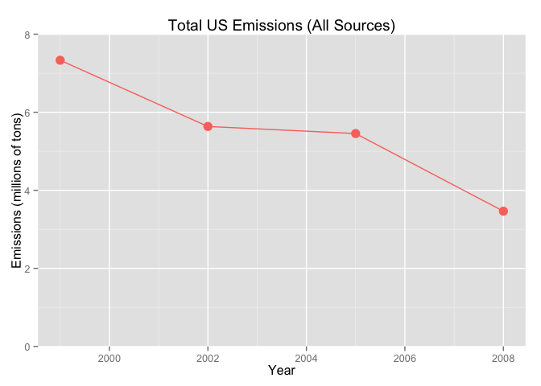
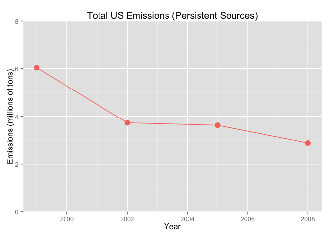
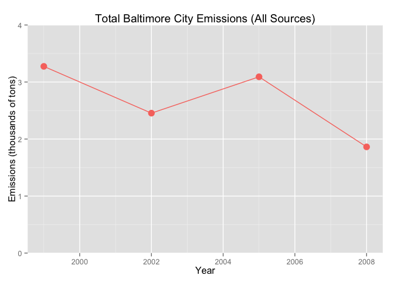
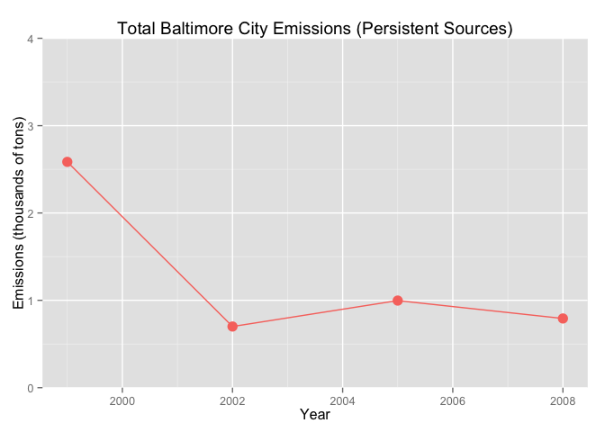
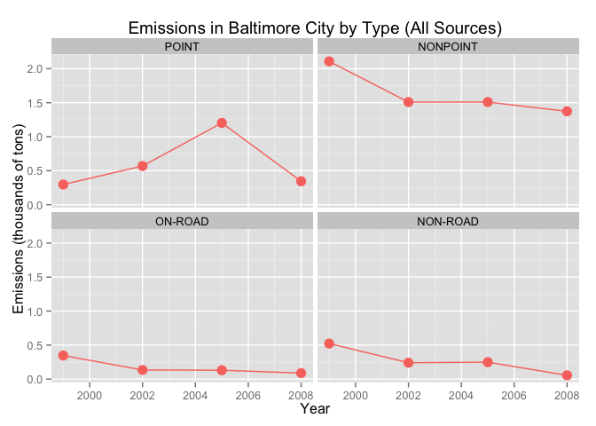
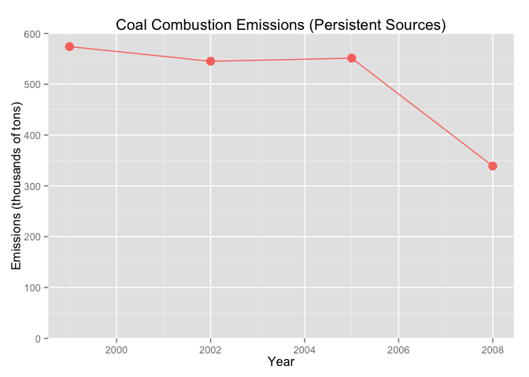
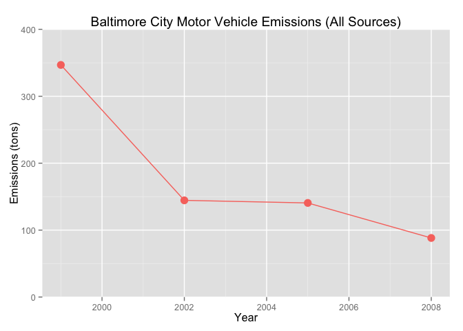
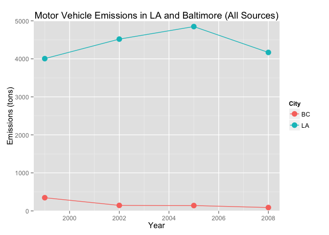

# Exploring Pollution in the U.S.
*Jeffrey Hallock*  

This document is an expansion of an R script written for Project 2 of the Coursera course "Exploratory Data Analysis" from Johns Hopkins University.

We explore pollution in the US by seeking to answer a series of 6 questions. The data were derived from the [EPA National Emissions Inventory web site](http://www.epa.gov/ttn/chief/eiinformation.html) and consist of two files:

- **summarySCC_PM25.rds**: contains a data frame with all of the PM2.5 (particulate matter less than 2.5 micrometers in diameter) emissions data for 1999, 2002, 2005, and 2008. For each year, the table contains the number of **tons** of PM2.5 emitted from a specific type of source for the entire year.

- **Source_Classification_Code.rds**: provides a mapping from the SCC (Sourse Classification Code) digit strings in the emissions data to the actual name of the PM2.5 source. Further imformation about the sources is also provided.

The emissions data contains the following variables:

1. **fips**: a five-digit number (represented as a string) indicating the U.S. county or area
2. **SCC**: the Source Classification Code, a digit string identifying the source
3. **Pollutant**: a string indicating the pollutant
4. **Emissions**: amount of PM2.5 emitted, in tons
5. **type**: the type of source (point, non-point, on-road, or non-road)
6. **year**: the year the emissions were recorded


The exact definitions and contents of emission source categories have been modified several times, but the following are general descriptions of the various types:

- **point**: Stationary sources of medium to large size measured at a single location; includes large industrial facilities and electric power plants, but also medium-size sources such as dry cleaners and gas stations 
- **non-point**: Small but stationary sources that are aggregated, usually by county; includes residential heating and consumer solvent use
- **on-road**: Mobile sources found on the road
- **non-road**: Non-road engines, equipment, and vehicles


```r
library(dplyr)
library(ggplot2)
```


First we read in the data. If the data is not in the directory we download it.


```r
if(file.exists("exdata-data-NEI_data/summarySCC_PM25.rds") &
   file.exists("exdata-data-NEI_data/Source_Classification_Code.rds")) {
        NEI <- readRDS("exdata-data-NEI_data/summarySCC_PM25.rds")
        SCC <- readRDS("exdata-data-NEI_data/Source_Classification_Code.rds")
} else if(file.exists("exdata-data-household_power_consumption.zip")) {
        unzip(unzip("exdata-data-NEI_data.zip"))
        NEI <- readRDS("summarySCC_PM25.rds")
        SCC <- readRDS("Source_Classification_Code.rds")
} else {
        temp <- tempfile()
        download.file("https://d396qusza40orc.cloudfront.net/exdata%2Fdata%2FNEI_data.zip",
                      method="curl", temp)
        unzip(temp)
        NEI <- readRDS("summarySCC_PM25.rds")
        SCC <- readRDS("Source_Classification_Code.rds")
        unlink(temp)
}

NEI[, 1:2] <- lapply(NEI[, 1:2], as.numeric)
NEI[[5]] <- factor(NEI[[5]], c("POINT", "NONPOINT", "ON-ROAD", "NON-ROAD"))
NEI <- tbl_df(NEI)
SCC <- tbl_df(SCC)
SCC$Short.Name <- as.character(SCC$Short.Name)
SCC$SCC <- as.numeric(levels(SCC$SCC))[SCC$SCC]
```

In the tables below we see that from 1999 to 2008, the number of annual pollution measurements steadily increased from 1.1 million to 2 million. We also see that measurements were taken at 4955 different unique location across 3249 different counties and areas. However, sources can be in multiple counties.


```r
table(NEI$year)
```

```
## 
##    1999    2002    2005    2008 
## 1108469 1698677 1713850 1976655
```

```r
length(unique(NEI$SCC))
```

```
## [1] 4955
```

```r
length(unique(NEI$fips))
```

```
## [1] 3249
```


# Question 1
  
**Have total emissions from PM2.5 decreased in the United States from 1999 to 2008?**
  
To start addressing this question, we can first look at the total amount of emissions for each of the 4 years. We do this by grouping the measurements by year and using the summarize function in the *dyplr* package.


```r
by_year_total <- (NEI %>% group_by(year)
                      %>% summarize(sum(Emissions)))

names(by_year_total) <- c("Year", "Total_Emissions")

g1 <- (ggplot(by_year_total, aes(Year, Total_Emissions/1e6))
       + geom_point(size = 4, color = "#F8766D")
       + geom_line(color = "#F8766D")
       + coord_cartesian(ylim = c(0, 8))
       + labs(y = "Emissions (millions of tons)")
       + ggtitle("Total US Emissions (All Sources)"))
g1
```

 

This graph strongly suggests that pollutant emissions have decreased between 1999 and 2008. However, this result could be affected by changes in what emission sources were measured in each year. To control for this, we can look at the emissions only from sources that were measured in each of the four years, which we designate here as **persistent sources**. When we do this, we retain the result that total emissions approximately halved from 1999 to 2008.


```r
#SCC's for each year, and their intersect
y1999_SCC <- filter(NEI, year == 1999)$SCC
y2002_SCC <- filter(NEI, year == 2002)$SCC
y2005_SCC <- filter(NEI, year == 2005)$SCC
y2008_SCC <- filter(NEI, year == 2008)$SCC
common_SCC <- intersect(y1999_SCC, y2002_SCC)
common_SCC <- intersect(common_SCC, y2005_SCC)
common_SCC <- intersect(common_SCC, y2008_SCC)

common_by_year_total <- (NEI %>% filter(SCC %in% common_SCC)
                             %>% group_by(year)
                             %>% summarize(sum(Emissions)))

names(common_by_year_total) <- c("Year", "Total_Emissions")

g2 <- (ggplot(common_by_year_total, aes(Year, Total_Emissions/1e6))
       + geom_point(size = 4, color = "#F8766D")
       + geom_line(color = "#F8766D")
       + coord_cartesian(ylim = c(0, 8))
       + labs(y = "Emissions (millions of tons)")
       + ggtitle("Total US Emissions (Persistent Sources)"))
g2
```

 


# Question 2

**Have total emissions from PM2.5 decreased in the Baltimore City, Maryland from 1999 to 2008?**

To address this question, we can repeat the above analysis on the subset of measurements taken in Baltimore City (fips = 24510). First we look at all emission sources, and then only at sources that were measured in all 4 years.


```r
by_year_total_BC <- (NEI %>% filter(fips == 24510)
                         %>% group_by(year)
                         %>% summarize(sum(Emissions)))

names(by_year_total_BC) <- c("Year", "Total_Emissions")

g3 <- (ggplot(by_year_total_BC, aes(Year, Total_Emissions/1e3))
       + geom_point(size = 4, color = "#F8766D")
       + geom_line(color = "#F8766D")
       + coord_cartesian(ylim = c(0, 4))
       + labs(y = "Emissions (thousands of tons)")
       + ggtitle("Total Baltimore City Emissions (All Sources)"))
g3
```

 


```r
NEI_BC <- filter(NEI, fips == 24510)

y1999_BC_SCC <- filter(NEI_BC, year == 1999)$SCC
y2002_BC_SCC <- filter(NEI_BC, year == 2002)$SCC
y2005_BC_SCC <- filter(NEI_BC, year == 2005)$SCC
y2008_BC_SCC <- filter(NEI_BC, year == 2008)$SCC
common_SCC_BC <- intersect(y1999_BC_SCC, y2002_BC_SCC)
common_SCC_BC <- intersect(common_SCC_BC, y2005_BC_SCC)
common_SCC_BC <- intersect(common_SCC_BC, y2008_BC_SCC)

common_BC_by_year_total <- (NEI_BC %>% filter(SCC %in% common_SCC_BC)
                                   %>% group_by(year)
                                   %>% summarize(sum(Emissions)))

names(common_BC_by_year_total) <- c("Year", "Total_Emissions")

g4 <- (ggplot(common_BC_by_year_total, aes(Year, Total_Emissions/1e3))
       + geom_point(size = 4, color = "#F8766D")
       + geom_line(color = "#F8766D")
       + coord_cartesian(ylim = c(0, 4))
       + labs(y = "Emissions (thousands of tons)")
       + ggtitle("Total Baltimore City Emissions (Persistent Sources)"))
g4
```

 

Sources measured in all 4 years drastically decreased from 1999 to 2002, and afterwards remained relatively stable. Including sources only measured in a subset of the years, we see that pollution also decreased significantly from 2005 to 2008. Both pictures show pollution drastically declining from 1999 to 2008.

# Question 3

**Of the four types of sources indicated by the type (point, nonpoint, onroad, nonroad) variable, which of these four sources have seen decreases in emissions from 1999–2008 for Baltimore City? Which have seen increases in emissions from 1999–2008?**

Since there are no "On-Road"-type sources that were measured in all 4 years in Baltimore City, we won't restrict ourselves here to only those sources that were measured all 4 years.


```r
by_year_type_BC_total <- (NEI %>% group_by(year)
                              %>% group_by(type, add=TRUE)
                              %>% filter(fips == 24510)
                              %>% summarize(sum(Emissions)))

names(by_year_type_BC_total) <- c("Year", "Type", "Total_Emissions")

g5 <- (ggplot(by_year_type_BC_total, aes(Year, Total_Emissions/1e3))
       + facet_wrap( ~ Type, ncol=2)
       + geom_point(size = 4, color = "#F8766D")
       + geom_line(color = "#F8766D")
       + labs(y = "Emissions (thousands of tons)")
       + ggtitle("Emissions in Baltimore City by Type (All Sources)"))
g5
```

 

In the above graph we see that the "NONPOINT"-, "ON-ROAD"-, and "NON-ROAD"-type sources all decreased, whereas "POINT"-type sources have increased. However, from 2005 to 2008 "POINT"-type sources have reversed most of those increases.


# Question 4

**Across the United States, how have emissions from coal combustion-related sources changed from 1999–2008?**

To identify coal combustion-related sources we search the "Short.Name" variable of the SCC data frame for occurences of "Comb" and "Coal". In the graph below we see that such emissions have drastically decreased from 2005 to 2008. The picture looks the same if we allow for sources that were not measured in all 4 years.


```r
coal_comb_SCC <- (SCC %>% select(SCC, Short.Name)
                      %>% filter(grepl("[Cc]oal", Short.Name))
                      %>% filter(grepl("[Cc]omb", Short.Name)))$SCC

coal_comb_by_year_total <- (NEI %>% filter(SCC %in% coal_comb_SCC)
                                %>% filter(SCC %in% common_SCC)
                                %>% group_by(year)
                                %>% summarize(sum(Emissions)))

names(coal_comb_by_year_total) <- c("Year", "Total_Emissions")

g6 <- (ggplot(coal_comb_by_year_total, aes(Year, Total_Emissions/1e3))
       + geom_point(size = 4, color = "#F8766D")
       + geom_line(color = "#F8766D")
       + coord_cartesian(ylim = c(0, 600))
       + labs(y = "Emissions (thousands of tons)")
       + ggtitle("Coal Combustion Emissions (Persistent Sources)"))
g6
```

 

# Question 5

**How have emissions from motor vehicle sources changed from 1999–2008 in Baltimore City?**

To address this question, we repeat the analyis from Question 2, but only retaining sources whose "Short.Name" contains the string "Veh". This will include all on road and off road vehicles and also more minor vehicle-related sources like vehicle surface coating solvents.

None of these motor vehicle sources were recorded in Baltimore City in all 4 years (only 15 were recorded in all 4 years regardless of location), so we will drop this requirement.


```r
veh_SCC <- filter(SCC, grepl("[Vv]eh", Short.Name))$SCC

veh_by_year_total_BC <- (NEI_BC %>% filter(SCC %in% veh_SCC)
                                %>% group_by(year)
                                %>% summarize(sum(Emissions)))

names(veh_by_year_total_BC) <- c("Year", "Total_Emissions")

g7 <- (ggplot(veh_by_year_total_BC, aes(Year, Total_Emissions))
       + geom_point(size = 4, color = "#F8766D")
       + geom_line(color = "#F8766D")
       + coord_cartesian(ylim = c(0, 400))
       + labs(y = "Emissions (tons)")
       + ggtitle("Baltimore City Motor Vehicle Emissions (All Sources)"))
g7
```

 

Based on the above figure, motor vehicle emissions dropped by more than two thirds from 1999 to 2008. Since the overall number of emissions measurements likely *increased* this period, this would serve to increase the total amount of emissions measured. We were unable to control for that here, but since it would be opposing, not contributing to, our observed downward trend, if anything, the true trend is stronger than that observed.


# Question 6

**Compare emissions from motor vehicle sources in Baltimore City with emissions from motor vehicle sources in Los Angeles County, California. Which city has seen greater changes over time in motor vehicle emissions?**

To answer this question for Los Angeles (fips = 06037) we can repeat the analysis we did for Baltimore City in Question 5.


```r
NEI_LA <- filter(NEI, fips == 06037)

veh_by_year_total_LA <- (NEI_LA %>% filter(SCC %in% veh_SCC)
                                %>% group_by(year)
                                %>% summarize(sum(Emissions)))

names(veh_by_year_total_LA) <- c("Year", "Total_Emissions")
veh_by_year_total_LA$City <- factor("LA")
veh_by_year_total_BC$City <- factor("BC")
veh_cities <- rbind(veh_by_year_total_BC, veh_by_year_total_LA)

g8 <- (ggplot(veh_cities, aes(Year, Total_Emissions))
       + geom_point(size = 4, aes(color = City))
       + geom_line(aes(color = City))
       + coord_cartesian(ylim = c(0, 5000))
       + labs(y = "Emissions (tons)")
       + ggtitle("Motor Vehicle Emissions in LA and Baltimore (All Sources)"))
g8
```

 

In above graph we see two striking differences between Baltimore City and Los Angeles: first, Los Angeles has a lot more motor vehicle-related emissions than Baltimore... over an order of magnitude more. However, according to Wikipedia (2015/09/04), the 2014 population of Baltimore is 620,961, while the 2014 "city" population of Los Angeles is 3,928,864, over 6 times that of Baltimore. Second, vehicle emissions in LA have gone up between 1999 and 2008, while in Baltimore they have gone down. In particular, LA emissions had larger absolute changes, increasing by almost a thousand tons between 1999 and 2005. Baltimore emissions, however, saw larger *relative* changes, with the previous graph from Question 5 showing a decline of over 67% from 1999 to 2008.

