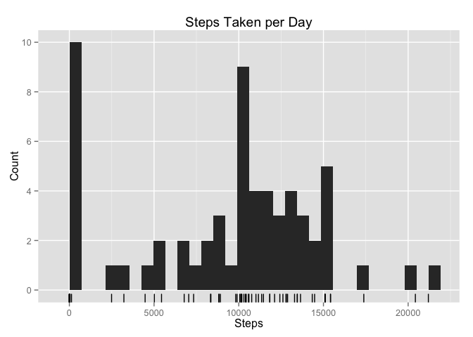
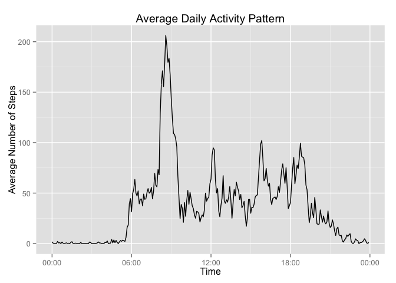
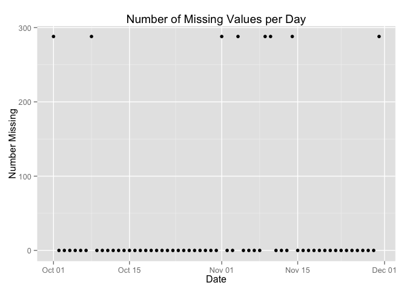
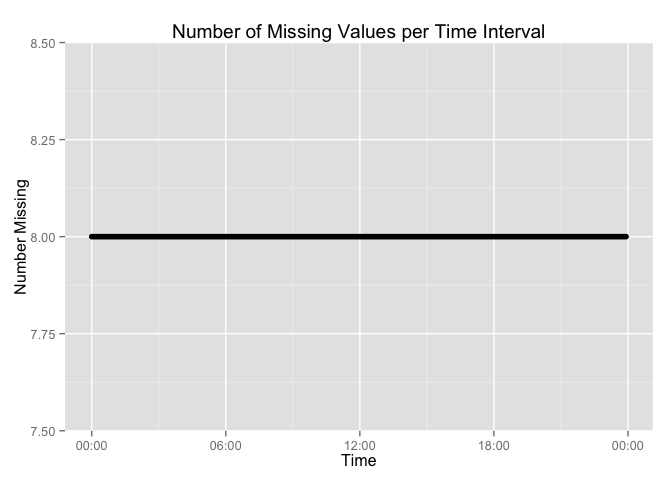
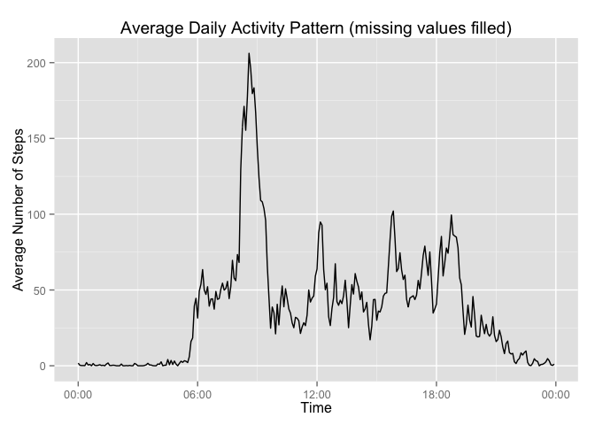
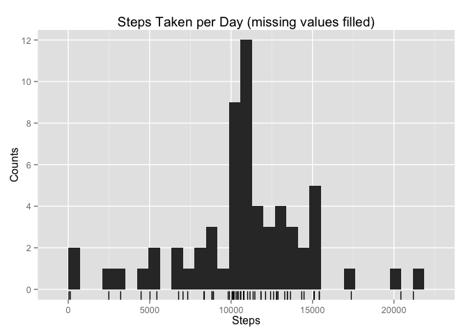
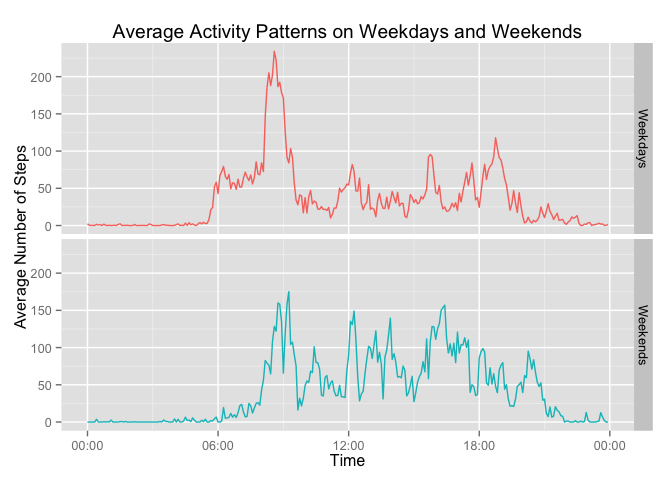

# Personal Activity Tracking
*Jeffrey Hallock*  

This document was written for Project 1 of the Coursera course "Reproducible Research" from Johns Hopkins University.

We examine data collected from a "personal activity monitoring device" which collects data at 5 minute intervals throughout the day. The data set consists of two months of data from an anonymous individual collected during the months of October and November, 2012 and includes the number of steps taken in 5 minute intervals each day.

The data is stored in a csv file with 17,568 observations of the following variables:

1. **Steps**: Number of steps taking in a 5-minute interval (missing values are coded as NA)
2. **Date**: The date on which the measurement was taken in YYYY-MM-DD format
3. **Interval**: Identifier for the 5-minute interval in which measurement was taken

We will look at 4 questions regarding the data:

1. How many steps are taken each day?
2. What is the average daily activity pattern?
3. How can we deal with missing values?
4. Are there differences in activity patterns between weekdays and weekends?


```r
library(ggplot2)
library(lubridate)
library(dplyr)
```

## Part 0: Loading and preprocessing the data

The key step here is converting the **interval** variable, where the number 1355 should be interpreted as "13:55", to the **Time** variable. Otherwise graphically there would be periodic gaps of size 60 in the data, such as between 13:55 and 14:00.


```r
if(file.exists("activity.csv")) {
    activity <- read.csv("activity.csv",
                         header = TRUE, stringsAsFactors = FALSE)
} else if(file.exists("activity.zip")) {
    activity <- read.csv(unz("activity.zip", "activity.csv"),
                         header = TRUE, stringsAsFactors = FALSE)
} else {
    temp <- tempfile()
    download.file("https://github.com/jhallock7/RepData_PeerAssessment1/blob/master/activity.zip?raw=true",temp)
    activity <- read.csv(unz(temp, "activity.csv"),
                         header = TRUE, stringsAsFactors = FALSE)
    unlink(temp)
}

activity <- tbl_df(activity)
activity$date <- ymd(activity$date)
names(activity) <- c("Steps", "Date", "Interval")

# From ?DateTimeClasses: "POSIXct" is more convenient for including
# in data frames, and "POSIXlt" is closer to human-readable forms."
activity$Time <- sprintf("%04d", activity$Interval)
activity$Time <- strptime(gsub('^(..)(..)$', '\\1:\\2:00', activity$Time), "%H:%M:%S")
activity$Time <- as.POSIXct(activity$Time)
```

## Question 1: How many steps are taken each day?

First, we look at the average answer to this question.


```r
sum(activity$Steps, na.rm = TRUE) / length(unique(activity$Date))
```

```
## [1] 9354.23
```

On average, the participant takes 9354 steps per day. Now to get a more fine-grained look, we tabulate the total number of steps taken each day.


```r
sum_by_day <- (activity %>% group_by(Date)
                        %>% summarize("Steps" = sum(Steps, na.rm=TRUE)))
as.data.frame(sum_by_day)
```

```
##          Date Steps
## 1  2012-10-01     0
## 2  2012-10-02   126
## 3  2012-10-03 11352
## 4  2012-10-04 12116
## 5  2012-10-05 13294
## 6  2012-10-06 15420
## 7  2012-10-07 11015
## 8  2012-10-08     0
## 9  2012-10-09 12811
## 10 2012-10-10  9900
## 11 2012-10-11 10304
## 12 2012-10-12 17382
## 13 2012-10-13 12426
## 14 2012-10-14 15098
## 15 2012-10-15 10139
## 16 2012-10-16 15084
## 17 2012-10-17 13452
## 18 2012-10-18 10056
## 19 2012-10-19 11829
## 20 2012-10-20 10395
## 21 2012-10-21  8821
## 22 2012-10-22 13460
## 23 2012-10-23  8918
## 24 2012-10-24  8355
## 25 2012-10-25  2492
## 26 2012-10-26  6778
## 27 2012-10-27 10119
## 28 2012-10-28 11458
## 29 2012-10-29  5018
## 30 2012-10-30  9819
## 31 2012-10-31 15414
## 32 2012-11-01     0
## 33 2012-11-02 10600
## 34 2012-11-03 10571
## 35 2012-11-04     0
## 36 2012-11-05 10439
## 37 2012-11-06  8334
## 38 2012-11-07 12883
## 39 2012-11-08  3219
## 40 2012-11-09     0
## 41 2012-11-10     0
## 42 2012-11-11 12608
## 43 2012-11-12 10765
## 44 2012-11-13  7336
## 45 2012-11-14     0
## 46 2012-11-15    41
## 47 2012-11-16  5441
## 48 2012-11-17 14339
## 49 2012-11-18 15110
## 50 2012-11-19  8841
## 51 2012-11-20  4472
## 52 2012-11-21 12787
## 53 2012-11-22 20427
## 54 2012-11-23 21194
## 55 2012-11-24 14478
## 56 2012-11-25 11834
## 57 2012-11-26 11162
## 58 2012-11-27 13646
## 59 2012-11-28 10183
## 60 2012-11-29  7047
## 61 2012-11-30     0
```

The daily number of steps ranges between 0 and 21,194. Note that 8 days list 0 steps taken. These are due to missing values and will be dealt with later. For now, we can use this table to make a histogram and look at the distribution of steps per day.


```r
g1 <- (ggplot(sum_by_day, aes(Steps))
       + geom_histogram()
       + geom_rug()
       + ggtitle("Steps Taken per Day")
       + coord_cartesian(ylim = c(-1/2, 10.5))
       + scale_y_discrete(breaks = c(0, 2, 4, 6, 8, 10), name = "Count")
       )
g1
```

 

The spike down towards 0 is again due to missing values and will be removed later. Otherwise, the distribution looks normally distributed. The mean and median of the distribution are 9354 (as calculated before) and 10395, respectively.


```r
mean(sum_by_day$Steps, na.rm=TRUE)
```

```
## [1] 9354.23
```

```r
median(sum_by_day$Steps, na.rm=TRUE)
```

```
## [1] 10395
```

## Question 2: What is the average daily activity pattern?

To address this question, we can make a time series plot of the average number of steps taken in each interval throughout the day. In the plot we see that the participant usually wakes up before 6 AM and goes to sleep between 9 AM and midnight. The largest spike shortly before 9 AM is likely a commute to work. Other spikes of movement occur around 12 PM, 4 PM, and 7 PM.


```r
mean_by_time <- (activity %>% group_by(Time)
                          %>% summarize("Average.Steps" = mean(Steps, na.rm=TRUE)))

g2 <- (ggplot(mean_by_time, aes(Time, Average.Steps))
       + geom_line()
       + ggtitle("Average Daily Activity Pattern")
       + ylab("Average Number of Steps")
       + scale_x_datetime(labels = c("00:00", "06:00", "12:00", "18:00", "00:00"))
       )
g2
```

 

Specifically, the participant usually takes the most steps (206) between 8:35 and 8:40 AM.


```r
mean_by_time[which.max(mean_by_time$Average.Steps),]
```

```
## Source: local data frame [1 x 2]
## 
##                  Time Average.Steps
##                (time)         (dbl)
## 1 2015-09-07 08:35:00      206.1698
```

## Question 3: How can we deal with missing values?

First lets look at how many missing values are in each column.


```r
colSums(is.na(activity))
```

```
##    Steps     Date Interval     Time 
##     2304        0        0        0
```

```r
mean(is.na(activity[,1]))
```

```
## [1] 0.1311475
```

There are 2304 missing values and they are all found in the "Steps" column, roughly 13% of rows. Let's look at how they are distributed across days.


```r
activity <- mutate(activity, Missing = is.na(Steps))

sum_NA_by_day <- (activity %>% group_by(Date)
                           %>% summarize("Missing" = sum(Missing)))

g3 <- (ggplot(sum_NA_by_day, aes(Date, Missing))
       + geom_point() + ylab("Number Missing") + ggtitle("Number of Missing Values per Day"))
g3
```

 

Most days have exactly 0 missing values, but for 8 days there are 288 missing values, which is the amount of 5 minute intervals in a day. In other words, for those 8 days no data were collected. They appear to be randomly distributed over the 2-month observation period. But do they tend to occur on a particular day of the week? If so, it could skew our daily activity pattern.


```r
missing_days <- filter(sum_NA_by_day, Missing == 288)
missing_days$Weekday <- weekdays(missing_days$Date)
missing_days$Weekday
```

```
## [1] "Monday"    "Monday"    "Thursday"  "Sunday"    "Friday"    "Saturday" 
## [7] "Wednesday" "Friday"
```

The missing days appear to be independent of the day of the week.

As an extra check, we can look to see how the missing values are distributed over the 5 minute intervals throughout the day. In the plot below we see that every interval has exactly 8 missing values, in agreement with our earlier observation that the data for each day are either measured completely or not at all.


```r
sum_NA_by_time <- (activity %>% group_by(Time)
                            %>% summarize("Missing" = sum(Missing)))

g4 <- (ggplot(sum_NA_by_time, aes(Time, Missing))
       + geom_point()
       + ylab("Number Missing")
       + ggtitle("Number of Missing Values per Time Interval")
       + scale_x_datetime(labels = c("00:00", "06:00", "12:00", "18:00", "00:00"))
       )
g4
```

 

Although the missing data are not harming our calculated average daily activity pattern, we did see earlier that they are changing the distribution of steps taken per day by putting a spike at 0. So we would like to fill in these missing values if we can. To do so, we can put in the number of steps we expect the participant to have taken during each 5 minute interval. In other words, we insert the average number of steps across all days for that 5 minute interval. This should not change the average daily activity pattern we saw earlier.

To do this, we create a "dictionary" where the key is the time of day and the value is the average number of steps taken during the next 5 minutes. We then loop over the rows of the data set, using the dictionary to replace missing values with the average.


```r
mean_by_time_list <- mean_by_time$Average.Steps
names(mean_by_time_list) <- mean_by_time$Time
activity$Steps.Fill <- activity$Steps

naFill <- function(row) {
    if(row[["Missing"]] == TRUE) {
        row[["Steps.Fill"]] <- mean_by_time_list[ format(row[["Time"]], "%Y-%m-%d %H:%M:%S") ]
    }
    row
}
```


```r
for(i in 1:nrow(activity)){
    activity[i,] <- naFill(activity[i,])
}
```


```r
mean_by_time_fill <- (activity %>% group_by(Time)
                               %>% summarize("Average.Steps.Fill" = mean(Steps.Fill)))

g5 <- (ggplot(mean_by_time_fill, aes(Time, Average.Steps.Fill))
       + geom_line()
       + ylab("Average Number of Steps")
       + ggtitle("Average Daily Activity Pattern (missing values filled)")
       + scale_x_datetime(labels = c("00:00", "06:00", "12:00", "18:00", "00:00"))
       )
g5
```

 

```r
sum(mean_by_time_fill$Average.Steps.Fill)
```

```
## [1] 10766.19
```

```r
sum(activity$Steps, na.rm = TRUE) / (length(unique(activity$Date)) - 8)
```

```
## [1] 10766.19
```

We can see that this average daily activity pattern is identical to the earlier one where we excluded the missing values. Note that this "average" day has a total of 10766 steps, which we could have calculated at the beginning by removing the 8 missing days. We can now recreate the Steps per Day histogram.


```r
sum_by_day_fill <- (activity %>% group_by(Date)
                             %>% summarize("Steps.Fill" = sum(Steps.Fill)))

g6 <- (ggplot(sum_by_day_fill, aes(Steps.Fill))
       + geom_histogram()
       + geom_rug()
       + xlab("Steps")
       + ggtitle("Steps Taken per Day (missing values filled)")
       + coord_cartesian(ylim = c(-1/2, 12.5))
       + scale_y_discrete(breaks = c(0, 2, 4, 6, 8, 10, 12), name = "Counts")
       )
g6
```

 

```r
mean(sum_by_day_fill$Steps.Fill)
```

```
## [1] 10766.19
```

```r
median(sum_by_day_fill$Steps.Fill)
```

```
## [1] 10766.19
```

As expected, the earlier spike of 8 days with 0 steps has shifted to the to the bin containing 10766, which is also the mean of the distribution, up from 9354 earlier. The median of the distribution also increased from 10395 to 10766.

## Question 4: Are there differences in activity patterns between weekdays and weekends?

To address this question, we create a factor variable specifying whether each day in the data set is a weekday or a weekend-day. We then compute average daily activity patterns for weekdays and weekend-days and plot them together. We do not use the filled in data, where the missing days were filled in with the overall average daily activity pattern, since here we are trying to differentiate between two types of days.


```r
activity$Weekday <- weekdays(activity$Date)

weekend <- function(x) {
    weekends <- c("Saturday", "Sunday")
    if(x %in% weekends) return("weekend")
    else                return("weekday")
}

activity$Weekend <- sapply(activity$Weekday, weekend)
activity$Weekend <- as.factor(activity$Weekend)

mean_by_weekend <- (activity %>% group_by(Date)
                             %>% group_by(Weekend, add=TRUE)
                             %>% summarize("Average.Steps" = sum(Steps, na.rm=TRUE))
                             %>% group_by(Weekend)
                             %>% summarize(mean(Average.Steps)))
mean_by_weekend
```

```
## Source: local data frame [2 x 2]
## 
##   Weekend mean(Average.Steps)
##    (fctr)               (dbl)
## 1 weekday            8820.356
## 2 weekend           10855.750
```


```r
mean_by_time_weekend <- (activity %>% group_by(Time)
                                  %>% group_by(Weekend, add=TRUE)
                                  %>% summarize("Average.Steps" = mean(Steps, na.rm=TRUE)))

levels(mean_by_time_weekend$Weekend) <- c("Weekdays", "Weekends")

g7 <- (ggplot(mean_by_time_weekend, aes(Time, Average.Steps))
       + facet_grid(Weekend ~ .)
       + geom_line(aes(color = Weekend))
       + ylab("Average Number of Steps")
       + ggtitle("Average Activity Patterns on Weekdays and Weekends")
       + scale_x_datetime(labels = c("00:00", "06:00", "12:00", "18:00", "00:00"))
       + scale_color_discrete(guide = FALSE)
       )
g7
```

 

First, note that the participant tends to take more steps on weekend-days (10856 steps) than on weekdays (8820 steps). Second, the participant wakes up later on weekend days (~8 AM) compared with weekdays (~6 AM). Third, on the weekends there is a moderate amount of activity between 8 and 9 PM that is not there are on the weekdays.


