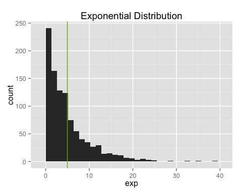
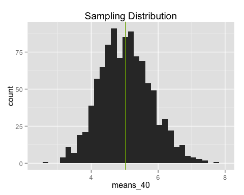
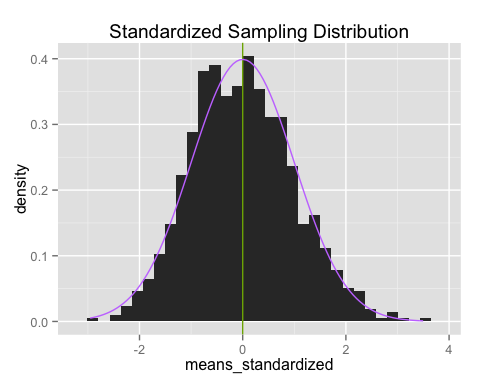

# A Central Limit Theorem Simulation
Jeffrey Hallock  

# Overview

The purpose of this document is to create a simple and very short demonstration of the central limit theorem, which states that the mean of a number of independent, identically distributed random variables converges to a normal distribution. To do so, we repeatedly draw samples of size 40 from an exponential distribution, which is highly non-Gaussian. However, we show that the means of these samples are approximately normally distributed around the true mean. The complete code can be found in the appendix.

# Simulations


Below is the code used to simulate the experiments. After setting the rate parameter of our exponential distribution to 0.2, we run two simulations. `exp` is just drawing 1000 random numbers from the exponential distribution. `means_40` is drawing 1000 samples, each of size 40, and reporting the mean of each.


```r
lambda = 0.2
exp = rexp(1000, lambda)
means_40 = NULL; for (i in 1:1000) means_40 = c(means_40, mean(rexp(40, lambda)))
```


# Sample Mean versus Theoretical Mean

The theoretical mean of the exponential distribution is $1/\lambda$, which in our case is 1/0.2 = 5. The empirical mean of our sample means, calculated below, is 5.02, less than a tenth of one sample standard deviation away. This demonstrates the general principle that the expected value of the mean of a sample is the mean of the population distribution. The sample mean is an unbiased estimator of the population mean.


```r
mean(means_40)
```

```
## [1] 5.024118
```

# Sample Variance versus Theoretical Variance

The variance of an exponential distribution is $\sigma^2 = 1/\lambda^2$. The theoretical sample variance is $\sigma^2 / n$ where n is the sample size, which in our case works out to $1/(n\lambda^2) = 1/(40 \cdot 0.2^2) = 1/(40 \cdot 0.04) = 1/1.6 = 0.625$. The empirical variance of our sample means, calculated below, is 0.609, in very good agreement. The sample variance (calculated using Bessel's correction) multiplied by the sample size is an unbiased estimator of the population variance.


```r
var(means_40)
```

```
## [1] 0.609325
```

# Distributions

Below we show the histograms of the `exp` and `means_40` variables, which roughly correspond to the population and sampling distributions, respectively.  Vertical lines are placed at the means. As calculated above, the sampling distribution is centered at 5.02, roughly the same as the population mean of 5.0, and has standard deviation $\sqrt{0.609} = 0.781$, in good agreement with the theoretical value of $1 / (\lambda \sqrt{n}) = 1/(0.2 \sqrt{40}) = 0.791$.






The sampling distribution looks similar to a normal distribution, but to make a direct comparison, we must standardize the `means_40` variable, meaning we subtract off the mean and divide by the standard deviation. Below we plot the standardized `mean_40` with a normal density curve.




Here we can directly see that the sampling distribution is roughly Gaussian distributed, the content of the central limit theorem. This is in spite of the highly non-Gaussian population distribution. If we were to increase the sample size above 40, the distribution would continue to converge to the Gaussian, and the variance would decrease, further concentrating the distribution about the population mean. In other words, larger sample sizes result in better estimates of the population mean. This intuitively makes sense, but the central limit theorem proves it to be true, and more so, tells us *just how good* of an estimate it will be.

\newpage

# Appendix: Code


```r
library(ggplot2)
set.seed(111)

lambda = 0.2
exp = rexp(1000, lambda)
means_40 = NULL; for (i in 1:1000) means_40 <- c(means_40, mean(rexp(40, lambda)))

mean(means_40)
var(means_40)

## Figure 1
(qplot(exp)
 + ggtitle("Exponential Distribution")
 + geom_vline(xintercept = mean(exp))
)

## Figure 2
(qplot(means_40)
 + ggtitle("Sampling Distribition")
 + geom_vline(xintercept = mean(means_40), color = "#7CAE00")
 + ggtitle("Sampling Distribution")
)

## Note that we divide by the population standard deviation.
## Dividing by the sample SD would result in a t-distribution,
## which still converges to the normal for large n.
## Even for n=40, the two are hardly distibguishable.
means_standardized = (means_40 - mean(means_40)) / ((1/lambda) / sqrt(40))

## Figure 3
(ggplot(as.data.frame(means_standardized), aes(x = means_standardized))
 + geom_histogram(aes(y = ..density..))
 + stat_function(fun=dnorm, color = "#F8766D")
 + ggtitle("Standardized Sampling Distribution")
)
```


