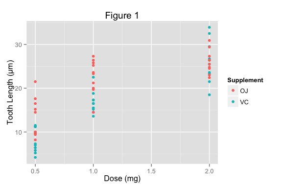

# Effect of Vitamin C on Tooth Length
Jeffrey Hallock  

# Overview

The purpose of this document is to perform a simple analysis of the "ToothGrowth" dataset found in the {datasets} package in R, fulfilling the second assignment of the "Statistical Inference" Coursera course from Johns Hopkins University. The dataset contains data published in 1952 from an experiment testing the effects of Vitamin C on tooth growth$^{[1]}$. Sixty guinea pigs were randomly divided into 6 groups of 10 each and each group was assigned a dosage (0.5, 1.0, or 2.0 milligrams) and supplement type: orange juice (natural), or ascorbic acid (artificial). Full code can be found in the appendix.

The dataset contains 60 observations of the following variables:

1. **len**: tooth length ($\mu$m)
2. **supp**:  supplement type, either "OJ" (Orange Juice) or "VC" (Vitamin C, ascorbic acid)
3. **dose**: dosage (mg)

We specifically would like to know if increasing the dosage of either supplement results in longer teeth, and for a given dosage, if one supplement results in longer teeth than the other. For this assignment, the only tools at our disposal are exploratory plots and t tests.

# Data Exploration

We want to know how the dose and delivery method of vitamin C affect tooth growth. To start, we make some exploratory plots of the data.


Figure 1 is a scatterplot of tooth length as a function of dose, colored by supplement type. While larger dosages of either supplement appear to result in larger tooth lengths, it also may appear that orange juice results in a larger increase than just pure vitamin C.



Figures 2 and 3 contain boxplots and histograms, respectively, for the different combinations of dose and supplement type. For the histograms, the means of each group are also plotted as vertical lines. We see that for each increase in dose, the distribution and mean tooth length for both supplements increased, with the smallest increase being from 1.0 to 2.0 milligrams of orange juice. Furthermore, for dosages 0.5 mg and 1.0 mg we see that the mean tooth lengths are higher for orange juice. However, we do not yet know if these results are statistically significant.


# Hypothesis Testing

We would like to compare different dosages for the same supplement, and different supplements for the same dosage. To do so, we will use t tests, which test to see how likely it is that the true mean tooth length of the two populations is different. This is against the null hypothesis, which is that the mean tooth lengths are the same, and the observed difference is due purely to chance.

## Assumptions

To perform t tests, we assume that for each dose and supplement type, tooth lengths are approximately normally distributed.  Note that we will **not** assume that tooth lengths for different supplement types have the same variance. These assumptions correspond specifically to the two sided Welch t test.

## Results

Nine t tests were performed and they fall into 3 categories.

Table 1 shows the results comparing the two different supplements for each dosage. For the 0.5 and 1.0 milligram dosages, the guinea pigs taking orange juice had average tooth lengths that were more than 5 micrometers larger than those of the guinea pigs taking just vitamin C. The p-values for those results are well below 0.05, indicating that there would have been a less than 5% chance of observing a difference between the mean tooth lengths of the two groups as large as what we observed *if the true population difference was zero*. Therefore we can reject this null hypothesis and claim that at those dosages, consuming orange juice results in greater tooth lengths compared with just taking vitamin C.

For the 2.0 milligram dose however, consuming orange juice resulted in slightly *lower* tooth lengths for the guinea pigs. However, the p-value for this result is extremely high. Therefore we can claim that for the 2.0 milligram dosage there is no difference in the effect on tooth lengths between consuming orange juice and consuming vitamin C.

Note that these results are also reflected in the 95% confidence intervals for the differences between the population means of the two supplements: 0 (the null hypothesis) is within the 2.0 milligram confidence interval, but is not within the 0.5 and 1.0 milligram intervals.


|  Group 1   |  Group 2   | Mean Increase (2 - 1) (µm) | 95% C.I. (µm) | t-value  | p-value  |
|:----------:|:----------:|:--------------------------:|:-------------:|:--------:|:--------:|
| VC, 0.5 µg | OJ, 0.5 µg |            5.25            | (1.72, 8.78)  | 3.17000  | 0.006359 |
| VC, 1.0 µg | OJ, 1.0 µg |            5.93            |  (2.8, 9.06)  | 4.03300  | 0.001038 |
| VC, 2.0 µg | OJ, 2.0 µg |           -0.08            | (-3.8, 3.64)  | -0.04614 | 0.963900 |

Table 2 shows the results comparing different pairs of dosages of orange juice. All of the p-values are below 0.05, and likewise, 0 is in none of the 95% confidence intervals for the true difference in mean tooth length between each population. Therefore we can assume with roughly 95% certainty that each increase in dose of orange juice does result in larger tooth lengths.


|  Group 1   |  Group 2   | Mean Increase (2 - 1) (µm) | 95% C.I. (µm) | t-value |  p-value  |
|:----------:|:----------:|:--------------------------:|:-------------:|:-------:|:---------:|
| OJ, 0.5 µg | OJ, 1.0 µg |            9.47            | (5.52, 13.42) |  5.049  | 8.785e-05 |
| OJ, 1.0 µg | OJ, 2.0 µg |            3.36            | (0.19, 6.53)  |  2.248  | 3.920e-02 |
| OJ, 0.5 µg | OJ, 2.0 µg |           12.83            | (9.32, 16.34) |  7.817  | 1.324e-06 |

Table 3 shows the results comparing different pairs of dosages of vitamin C (ascorbic acid). Just like for orange juice, all of the p-values are below 0.05 and 0 is in none of the 95% confidence intervals. Therefore we can assume with roughly 95% certainty that each increase in dose of vitamin C does result in larger tooth lengths.


|  Group 1   |  Group 2   | Mean Increase (2 - 1) (µm) | 95% C.I. (µm) | t-value |  p-value  |
|:----------:|:----------:|:--------------------------:|:-------------:|:-------:|:---------:|
| VC, 0.5 µg | VC, 1.0 µg |            8.79            | (6.31, 11.27) |  7.463  | 6.811e-07 |
| VC, 1.0 µg | VC, 2.0 µg |            9.37            | (5.69, 13.05) |  5.470  | 9.156e-05 |
| VC, 0.5 µg | VC, 2.0 µg |           18.16            | (14.42, 21.9) | 10.390  | 4.680e-08 |

# Conclusions

The data clearly indicates that larger doses of either orange juice or vitamin C result in longer teeth for the guinea pigs. This was confirmed using two sided Welch t tests. We also likewise confirmed that the data statistically supports the hypothesis that at the lower dosages (0.5 and 1.0 milligrams) orange juice outperforms pure vitamin C. At the highest dosage (2.0 milligrams) however, there is no statistically significant difference. It is assumed that the random assignment of guinea pigs to each test group makes the presence of confounding variables highly unlikely.

# References

[1]: C. I. Bliss (1952) *The Statistics of Bioassay.* Academic Press.


# Appendix: Code


```r
library(ggplot2)
library(knitr)
library(dplyr)

# Import data and change one of the variable names
data(ToothGrowth)
ToothGrowth = tbl_df(ToothGrowth)
ToothGrowth = rename(ToothGrowth, Supplement = supp)

########################################################
## Exploratory Figures
########################################################

# Figure 1
g1 = (ggplot(ToothGrowth, aes(y = len, x = dose, color = Supplement))
      + geom_point()
      + xlab("Dose (mg)") + ylab("Tooth Length (µm)") + ggtitle("Figure 1"))
g1

# Figure 2
g2 = (ggplot(ToothGrowth, aes(x = factor(dose), y = len,  color = Supplement))
      + geom_boxplot()
      + xlab("Dose (mg)") + ylab("Tooth Length (µm)") + ggtitle("Figure 2"))
g2

# Calculate mean tooth length for each Dose/Supplement combination
grouped = (ToothGrowth
         %>% group_by(dose)
         %>% group_by(Supplement, add=TRUE)
         %>% summarize("mean_len" = mean(len)))

# Figure 3
g3 = (ggplot(ToothGrowth)
      + facet_grid(dose ~ .)
      + geom_histogram(aes(x = len, fill = Supplement))
      + geom_vline(data=grouped, aes(xintercept = mean_len, color = Supplement))
      + xlab("Count") + ylab("Tooth Length (µm)") + ggtitle("Figure 3"))
g3

########################################################
## Define function for formatting and printing t-test results
########################################################

print_test = function(t1, t2, t3, G1, G2, G3, G4, G5, G6, caption) {
    # Isolate confidence intervals and format them as (lower, upper)
    CIs = data.frame(CI_lower = c(t1$conf.int[1], t2$conf.int[1], t3$conf.int[1]),
                     CI_upper = c(t1$conf.int[2], t2$conf.int[2], t3$conf.int[2])
                     )
    CIs = round(CIs, 2)
    CIs$CI = paste("(", CIs$CI_lower, ", ", CIs$CI_upper, ")", sep = "")
    CIs = CIs[[3]]
    
    # Make table of results
    tests = data.frame(mean_diff = c(t1$estimate[[1]] - t1$estimate[[2]],
                                     t2$estimate[[1]] - t2$estimate[[2]],
                                     t3$estimate[[1]] - t3$estimate[[2]]),
                       t = c(t1$statistic, t2$statistic, t3$statistic),
                       p = c(t1$p.value, t2$p.value, t3$p.value))
    tests = signif(tests, 4)
    tests$Group_1 = c(G1, G3, G5); tests$Group_2 = c(G2, G4, G6); tests$CI = CIs
    tests = tests[c("Group_1", "Group_2", "mean_diff", "CI", "t", "p")]

    # Print results
    kable(tests,
          format = 'markdown',
          col.names = c("Group 1", "Group 2", "Mean Increase (2 - 1) (µm)",
                        "95% C.I. (µm)", "t-value", "p-value"),
          align = 'c', digits = 10, caption = caption)
    }

########################################################
## Tests for differential supplement effect per dose
########################################################
# Isolate each separate dose/supplement combination
OJ_0.5 = filter(ToothGrowth, Supplement == "OJ" & dose == 0.5)[[1]]
VC_0.5 = filter(ToothGrowth, Supplement == "VC" & dose == 0.5)[[1]]
OJ_1.0 = filter(ToothGrowth, Supplement == "OJ" & dose == 1.0)[[1]]
VC_1.0 = filter(ToothGrowth, Supplement == "VC" & dose == 1.0)[[1]]
OJ_2.0 = filter(ToothGrowth, Supplement == "OJ" & dose == 2.0)[[1]]
VC_2.0 = filter(ToothGrowth, Supplement == "VC" & dose == 2.0)[[1]]

print_test(t.test(OJ_0.5, VC_0.5),
           t.test(OJ_1.0, VC_1.0),
           t.test(OJ_2.0, VC_2.0),
           "VC, 0.5 µg", "OJ, 0.5 µg",
           "VC, 1.0 µg", "OJ, 1.0 µg",
           "VC, 2.0 µg", "OJ, 2.0 µg",
           "Effect of supplement per dose")

########################################################
## Tests for differential dose effects for orange juice
########################################################
print_test(t.test(OJ_1.0, OJ_0.5),
           t.test(OJ_2.0, OJ_1.0),
           t.test(OJ_2.0, OJ_0.5),
           "OJ, 0.5 µg", "OJ, 1.0 µg",
           "OJ, 1.0 µg", "OJ, 2.0 µg",
           "OJ, 0.5 µg", "OJ, 2.0 µg",
           "Effect of dose change for Orange Juice")

########################################################
## Tests for differential dose effects for vitamin C
########################################################
print_test(t.test(VC_1.0, VC_0.5),
           t.test(VC_2.0, VC_1.0),
           t.test(VC_2.0, VC_0.5),
           "VC, 0.5 µg", "VC, 1.0 µg",
           "VC, 1.0 µg", "VC, 2.0 µg",
           "VC, 0.5 µg", "VC, 2.0 µg",
           "Effect of dose change for vitamin C (ascorbic acid)")
```


