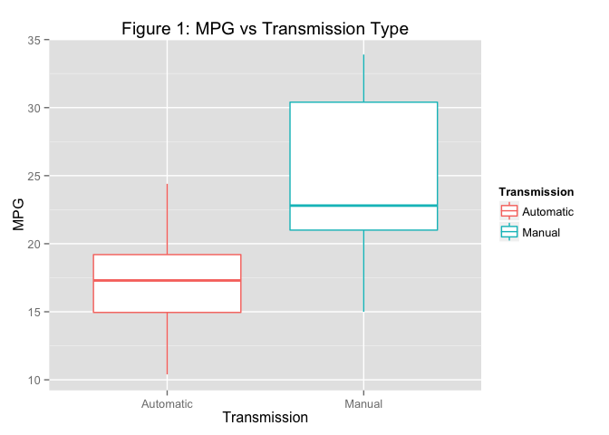
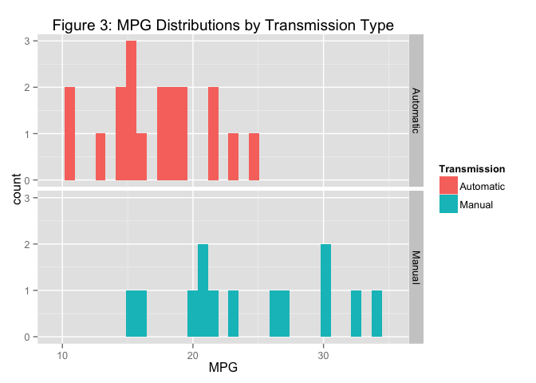
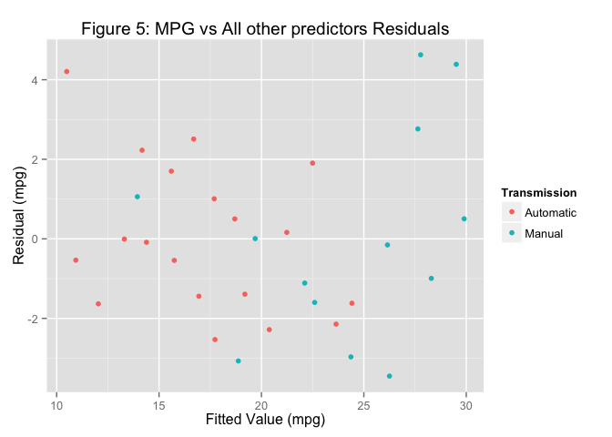

# Linear Regression
Jeffrey Hallock  

## Overview

For this assignment (for the Linear Regression Coursera course from Johns Hopkins University) I work for *Motor Trend*, a magazine about the automobile industry. The magazine is interested in exploring the relationship between a set of variables and miles per gallon (MPG). They are particularly interested in the following two questions:

**Question 1**: Is an automatic or manual transmission better for MPG?  
**Question 2**: Quantify the MPG difference between automatic and manual transmissions.

The {mtcar} dataset, built into R, will be used to address these questions, and comes from the 1974 issue of *Motor Trend*. It comprises MPG and 10 other aspects of automobile design and performance for 32 automobiles.

The questions with be answered with some exploratory plots and linear regression. Full code can be found in the appendix.


## Question 1: Is an automatic or manual transmission better for MPG?

Figure 1 below shows boxplots of the distributions of MPG for the two types of transmissions, and clearly indicates that manual transmission cars usually have higher MPG (+7.25 mpg on average).

Figure 2 shows a scatterplot of MPG versus vehicle weight for all 32 cars in the dataset, colored by transmission type. Again we see that manual transmission cars have higher MPG, but we also see they tend to be lighter.




## Question 2: Quantify the MPG difference between automatic and manual transmissions.

To quantify the difference in MPG between cars with automatic versus manual transmissions, we would like to perform a linear regression.

### Assumptions

First we check for two aspects of the data important for linear regression: linearity and homoscedasticity. The first is that the relationship between transmission type and MPG is approximately linear. Because the predictor variable is binary there cannot be any non-linear effects, and so a linear model would be appropriate.

The second is that the variance in the response does not depend on the predictors (i.e. the data is homoscedastic). Figure 3 below shows the distributions of MPG for the two different transmission types. The standard deviations are 3.83 and 6.17 for automatic and manual transmission cars, respectively, for a difference of 2.33 MPG. We regard this as sufficiently small that linear regression is appropriate. We will readdressed this when we look at the residual plots of our linear models. Note alse that there are no significant outliers, and in the binary setting there cannot be any high leverage points.



### Linear Regression 1: MPG vs Transmission Type

To start, we first perform a linear regression only between MPG and transmission type. In Table 1 below we see that cars with manual transmissions had on average 7.25 (±1.76 S.E.) more MPG. The p value of this result is extremely small, indicating that this trend is almost surely not due to chance. The residual plot below mirrors Figure 3 above, indicating that the cars predicted to have a MPG of about 24.5 (manual transmissions) have a slightly higher standard deviation for MPG than those with a MPG of about 17 (automatic transmissions). Since our goal is not to *predict* MPG from transmission type, but only to determine the general effect of transmission type on MPG, the small difference in variance almost surely won't affect our conclusions.

So ignoring all other variables that could impact MPG, manual transmission cars tend to get over 7 more MPG than those with automatic transmissions.


|                   | Estimate| Std. Error|  t value| Pr(>&#124;t&#124;)|
|:------------------|--------:|----------:|--------:|------------------:|
|(Intercept)        | 17.14737|    1.12460| 15.24749|            0.00000|
|TransmissionManual |  7.24494|    1.76442|  4.10613|            0.00029|


### Linear Regression 2: MPG vs All Other Predictors

Table 2 shows the effect of each variable on MPG with every other variable held fixed. Here we see that manual transmission cars had on average only 2.5 (±2.1 S.E.) more MPG. In other words, switching a car to a manual transmission *while holding all other variables constant* would increase MPG by an average of 2.5. This is a large reduction from the over 7 MPG we saw above. The reason for this reduction is that the *most* important indicator of MPG is the vehicle weight (largest coefficient and smallest p value below), with heavier vehicles receiving lower MPG. In Figure 2 we see that cars with automatic transmissions are usually heavier (by ~50%), likely the primary reason why they get lower MPG. Removing this indirect effect on MPG through the vehicle's weight (and all other variables), manual transmissions *directly* increase MPG by only 2.5.

The residual plot below shows that the residuals appear to be independent of the fitted value with roughly constant variance. The $R^2$ value of the linear fit is 0.87, usually interpreted to mean that the linear model explains 87% of the variability in the data. Together these indicate that a linear model is appropriate and is well fitted to the data. However, the large p value of 0.23 for the manual transmission coefficient indicates that this *direct* effect of higher MPG for manual transmission cars is not statistically significant enough to infer that it holds for the entire population of cars from which this sample was taken (1973-1974 cars).


Table: Table 2: MPG vs. All Other Variables

                      Estimate   Std. Error    t value   Pr(>|t|)
-------------------  ---------  -----------  ---------  ---------
(Intercept)           12.30337     18.71788    0.65731    0.51812
Cylinders             -0.11144      1.04502   -0.10664    0.91609
Displacement           0.01334      0.01786    0.74676    0.46349
Horsepower            -0.02148      0.02177   -0.98684    0.33496
Axle_Ratio             0.78711      1.63537    0.48130    0.63528
Weight                -3.71530      1.89441   -1.96119    0.06325
Qrt_Mile_Time          0.82104      0.73084    1.12341    0.27394
V_S                    0.31776      2.10451    0.15099    0.88142
TransmissionManual     2.52023      2.05665    1.22540    0.23399
Num_Gears              0.65541      1.49326    0.43891    0.66521
Num_Carburetors       -0.19942      0.82875   -0.24063    0.81218




# Conclusion

Manual transmission cars receive significantly higher MPG ratings (7.25±1.76), but most of this effect is due to their reduced weight. While in this dataset transmission type did have a weak *direct* effect on MPG, a larger dataset would be needed to test if this effect holds in general. Also, it is important to note that the dataset used in this analysis is over 40 years old; it is likely that automatic transmissions have since become more advanced and fuel efficient.

# Appendix: Code


```r
library(ggplot2)
library(knitr)
library(dplyr)

############################################################
## Load data, rename variables
############################################################

data(mtcars)
mtcars = tbl_df(mtcars)
mtcars$am = factor(mtcars$am, labels = c("Automatic", "Manual"))

mtcars = rename(mtcars,
                MPG = mpg,
                Cylinders = cyl,
                Displacement = disp,
                Horsepower = hp,
                Axle_Ratio = drat,
                Weight = wt,
                Qrt_Mile_Time = qsec,
                V_S = vs,
                Transmission = am,
                Num_Gears = gear,
                Num_Carburetors = carb)

############################################################
## Explorotory Figures
############################################################

(ggplot(mtcars, aes(y = MPG, x = Transmission, color=Transmission))
    + geom_boxplot()
    + ggtitle("Figure 1"))

(ggplot(mtcars, aes(y = MPG, x = Weight, color = Transmission))
    + geom_point()
    + ggtitle("Figure 2"))

(ggplot(mtcars, aes(x = MPG, fill = Transmission))
    + geom_histogram() + facet_grid(Transmission~.)
    + ggtitle("Figure 3"))

############################################################
## Linear Regression 1
############################################################

model1 = lm(data = mtcars, formula = MPG~Transmission)
kable(coef(summary.lm(model1)),
      format = 'markdown',
      digits=5,
      caption = "Table 1: MPG vs. Transmission Type")
mtcars$MPG_hat_1 = predict.lm(model1, mtcars)
mtcars = mutate(mtcars, Residuals_1 = MPG - MPG_hat_1)
qplot(y = Residuals_1,
      x = MPG_hat_1,
      color = Transmission,
      xlab = "Fitted Value",
      ylab = "Residual",
      main = "Figure 4: MPG vs Transmission Type Residuals")

mtcars$MPG_hat_1 = NULL
mtcars$Residuals_1 = NULL

############################################################
## Linear Regression 2
############################################################

model2 = lm(data = mtcars, formula = MPG~.)
kable(coef(summary.lm(model2)),
      format = 'markdown',
      digits=5,
      caption = "Table 2: MPG vs. All Other Variables")
mtcars$MPG_hat_2 = predict.lm(model2, mtcars)
mtcars = mutate(mtcars, Residuals_2 = MPG - MPG_hat_2)
qplot(data = mtcars,
      y = Residuals_2,
      x = MPG_hat_2,
      color = Transmission,
      xlab = "Fitted Value",
      ylab = "Residual",
      main = "Figure 5: MPG vs All other predictors Residuals")
```


