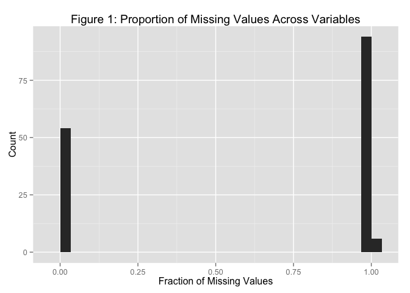
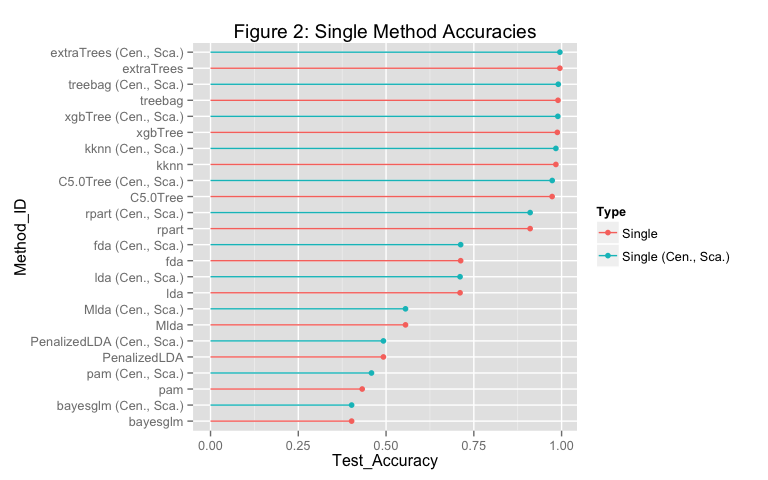
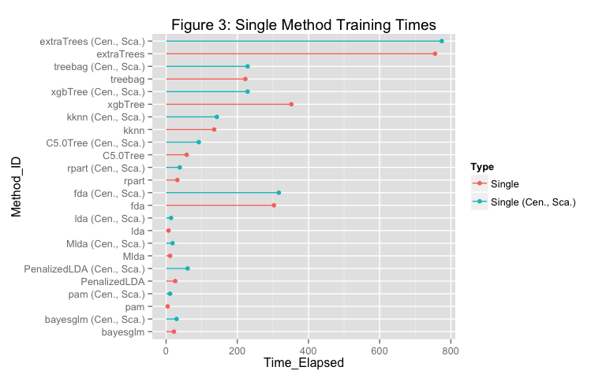
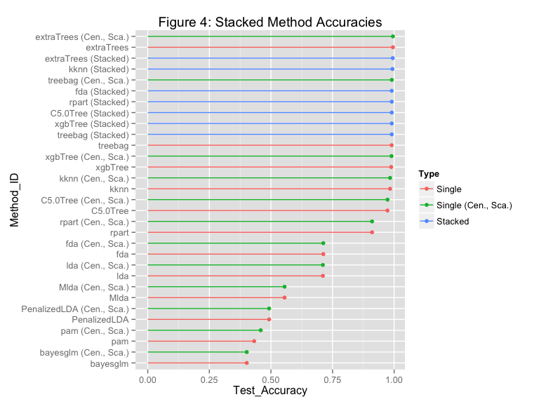
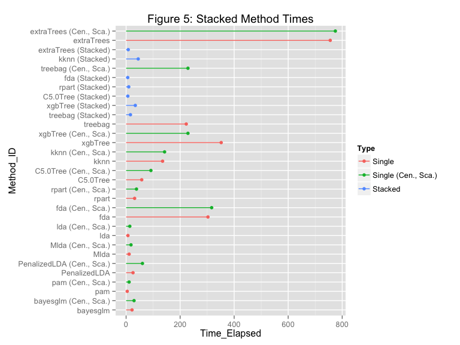

# Machine Learning Classification
Jeffrey Hallock  

# Overview

In this assignment for the Practical Machine Learning Coursera course from Johns Hopkins University, our goal is to build a classification algorithm for the Weight Lifting Exercises dataset$^{[1]}$. In the cited study, six young, healthy, male participants were asked to perform "Unilateral Dumbbell Biceps Curls" (dumbbell lifts) in five different ways, labeled as classes A through E: (A) exactly according to specification, i.e., "correctly", (B) throwing the elbows to the front, (C) lifting the dumbbell only halfway, (D) lowering the dumbbell only halfway, and (E) throwing the hips to the front. The participants were supervised by experienced weight lifters to ensure they were performing the exercises to specification. Data were collected during the exercises by accelerometers on the participants' belt, arm, forearm, and dumbbell.

The goal of the assignment is to use the data to predict which of the 5 classes the given execution of the exercise belongs to. This is an example of "Human Activity Recognition", where the goal is not simply to identify "which" exercises are being performed and "how often", but rather to identify "how well" given activities are being performed.

Algorithms integrated with R's caret package will be used for the classification. The algorithm design space we will manually search over includes: **(1)** choice of algorithm, **(2)** choice of "tune length", a caret parameter controlling how many internal algorithm parameter combinations to search over, **(3)** whether to center and scale the predictors before training, and **(4)** whether to combine algorithms into a so-called "stacked" model.

## Part 1: Load and Preprocess the Data

In the code below we load the (already downloaded) data into R and divided it randomly into a "Build" dataset (70%), used to build the model, and a "Validation" dataset (30%), which will be used to measure the generalization error of the final model. The "Build" dataset is further split into "Train" and "Test" datasets (70%-30%) used for training the models and performing model selection, respectively. Variables are appropriately changed to types "numeric" and "factor", and the first six (unimportant) variables are removed.


```r
library(caret)
library(ggplot2)
library(plyr)
library(dplyr)
library(knitr)
library(extraTrees)

# Load data
data = read.csv("pml-training.csv", stringsAsFactors = FALSE)

# Divide data into train and test sets
inBuild = createDataPartition(y=data$classe, p=0.7, list=FALSE)
build = tbl_df(data[inBuild,])
validation = tbl_df(data[-inBuild,])

inTrain = createDataPartition(y=build$classe, p=0.7, list=FALSE)
train = build[inTrain,]
test = build[-inTrain,]

# Convert correct outcome to a factor variable
build$classe = as.factor(build$classe)
train$classe = as.factor(train$classe)
test$classe = as.factor(test$classe)
validation$classe = as.factor(validation$classe)

# Remove first 6 columns
build = build[, -c(1:6)]
train = train[, -c(1:6)]
test = test[, -c(1:6)]
validation = validation[, -c(1:6)]

# Convert all predictors to class numeric
for (i in 1:(length(build)-1)) {
    build[[i]] = as.numeric(as.character(build[[i]]))
    train[[i]] = as.numeric(as.character(train[[i]]))
    test[[i]] = as.numeric(as.character(test[[i]]))
    validation[[i]] = as.numeric(as.character(validation[[i]]))
}
```

As calculated below, the training data consists of 9619 observations of 154 variables. Figure 1 shows a histogram of the proportion of missing values within the "train" set across all variables. We see that 54 of the variables have zero missing values, and the rest have a proportion of missing values above 95%. We remove those variables from the data.


```r
# Table 1: Data Dimensions
knitr::kable(data.frame(Dimension = c('Rows', 'Columns'),
                        Size = dim(train)),
             format = 'markdown',
             caption='Table 1: Data Dimensions')
```


|Dimension | Size|
|:---------|----:|
|Rows      | 9619|
|Columns   |  154|

```r
# Figure 1: Proportion of Missing Values Across Variables
(ggplot2::qplot(colMeans(is.na(train)))
+ xlab('Fraction of Missing Values')
+ ylab('Count')
+ ggtitle('Figure 1: Proportion of Missing Values Across Variables'))
```




```r
# Filter out predictors with more than 50% missing values
build = build[colMeans(is.na(build)) < .5]
train = train[colMeans(is.na(train)) < .5]
test = test[colMeans(is.na(test)) < .5]
validation = validation[colMeans(is.na(validation)) < .5]
```

## Part 2: Model Selection and Training: Single Models

Machine learning algorithms integrated with R's caret package are used to classify the data. The `method` argument of caret's `train` function is used to specify the method, with the `tuneLength` parameter specifying how many model parameter combinations to search over. The `testMethod` function shown below trains the given method on the data while timing it, and appends a row to an inputted table with the (test set) accuracy and time elapsed for the given method. The specific model is also returned. The `testScaledMethod` function does the same thing but centers and scales the predictors first. Twelve different algorithms are tested, with tune lengths chosen to maximize accuracy without pushing training times much above 5 minutes.

In the code below, the desired methods, method names, and tune lengths are assembled into a data frame which is then looped over with the `testMethod` and `testScaledMethod` functions. While this compact representation was tested and is functional, it is primarily for presentation purposes. The actual code used is equivalent except each method is a separate code chunk, convenient for caching.


```r
set.seed(111)
# Split data up into predictors and outcomes
data_build_Pred = build[-54]
data_build_Classes = build[[54]]
data_train_Pred = train[-54]
data_train_Classes = train[[54]]
data_test_Pred = test[-54]
data_test_Classes = test[[54]]
data_validation_Pred = validation[-54]
data_validation_Classes = validation[[54]]

# Initialize table of results
methodSummary = data.frame(Method_ID = c(''),
                           Method_Name = c(''),
                           Type = c(''),
                           tuneLength = c(0),
                           Test_Accuracy = c(0),
                           Time_Elapsed = c(0))

# testMethod function
testMethod = function(method, name, tL, methodSummary) {
    set.seed(111)
    # Train model while timing it
    tm = system.time(model <- caret::train(x = data_train_Pred,
                                           y = data_train_Classes,
                                           method=method,
                                           tuneLength=tL))
    # Compute predictions and confusion matrix; build new row table
    pred = predict(model, newdata=data_test_Pred)
    conf = caret::confusionMatrix(pred, data_test_Classes)
    row = data.frame(Method_ID = method,
                     Method_Name = name,
                     Type = 'Single',
                     tuneLength = tL,
                     Test_Accuracy = conf$overall[[1]],
                     Time_Elapsed = tm[[1]])
    # Add new row to table; return list of model and table
    methodSummary = rbind(methodSummary, row)
    list(model, methodSummary)
}

# testScaledMethod function
testScaledMethod = function(method, name, tL, methodSummary) {
    set.seed(111)
    # Train model while timing it; Include Preprocessing
    tm = system.time(model <- caret::train(x = data_train_Pred,
                                           y = data_train_Classes,
                                           preProcess = c('center', 'scale'),
                                           method=method,
                                           tuneLength=tL))
    # Compute predictions and confusion matrix; build new row table
    pred = predict(model, newdata=data_test_Pred)
    conf = caret::confusionMatrix(pred, data_test_Classes)
    row = data.frame(Method_ID = paste(method, '(Cen., Sca.)'),
                     Method_Name = name,
                     Type = 'Single (Cen., Sca.)',
                     tuneLength = tL,
                     Test_Accuracy = conf$overall[[1]],
                     Time_Elapsed = tm[[1]])
    # Add new row to table; return list of model and table
    methodSummary = rbind(methodSummary, row)
    list(model, methodSummary)
}
```


```r
# Create dataframe of algorithms to train with
methods = c('treebag',
            'xgbTree',
            'kknn',
            'C5.0Tree',
            'rpart',
            'extraTrees',
            'fda',
            'Mlda',
            'PenalizedLDA',
            'pam',
            'bayesglm',
            'lda')

methodTLs = c(1,
              2,
              1,
              1,
              50,
              1,
              2,
              5,
              5,
              5,
              5,
              5)

methodNames = c('Bagged CART',
                'eXtreme Gradient Boosting',
                'Weighted k-Nearest Neighbors',
                'Single C5.0 Tree',
                'CART',
                'Random Forest by Randomization',
                'Flexible Discriminant Analysis',
                'Maximum Uncertainty LDA',
                'Penalized LDA',
                'Nearest Shrunken Centroids',
                'Bayesian Generalized Linear Model',
                'Linear Discriminant Analysis')

methodDF = data.frame(methods, methodNames, methodTLs)
methodDF$methods = as.character(methodDF$methods)
methodDF$methodNames = as.character(methodDF$methodNames)

# Initialize list of models
models = list()

# Train models
for(i in 1:nrow(methodDF)) {
    modelList = testMethod(method = methodDF[[i,1]],
                       name = methodDF[[i,2]],
                       tL = methodDF[[i,3]],
                       methodSummary)
    models[[2*i-1]] = modelList[[1]]
    methodSummary = modelList[[2]]
    
    modelList = testScaledMethod(method = methodDF[[i,1]],
                             name = methodDF[[i,2]],
                             tL = methodDF[[i,3]],
                             methodSummary)
    models[[2*i]] = modelList[[1]]
    methodSummary = modelList[[2]]
}

# Extract individual models
model1 = models[[1]]; model2 = models[[2]]
model3 = models[[3]]; model4 = models[[4]]
model5 = models[[5]]; model6 = models[[6]]
model7 = models[[7]]; model8 = models[[8]]
model9 = models[[9]]; model10 = models[[10]]
model11 = models[[11]]; model12 = models[[12]]
model13 = models[[13]]; model14 = models[[14]]
model15 = models[[15]]; model16 = models[[16]]
model17 = models[[17]]; model18 = models[[18]]
model19 = models[[19]]; model20 = models[[20]]
model21 = models[[21]]; model22 = models[[22]]
model23 = models[[23]]; model24 = models[[24]]
```


```
## 12345678910111213141516171819202122232425262728293011111111111111111111111111
```


```
## 12345678910111213141516171819202122232425262728293011111111111111111111111111
```


```r
library(ggplot2)
library(dplyr)

# Format training results
methodSummary = dplyr::tbl_df(methodSummary)
methodSummary = methodSummary[-1,]
methodSummary = methodSummary[order(-methodSummary$Test_Accuracy),]
methodSummary$Method_ID = as.factor(methodSummary$Method_ID)
methodSummary = transform(methodSummary, Method_ID=reorder(Method_ID, Test_Accuracy))

# Isolate best method
bestSingleMethod = unclass(methodSummary[1,])
bestSingleMethod$Method_ID = as.character(bestSingleMethod$Method_ID)
```


Table 2 below shows the results of fitting the 12 models to the data. Figures 2 and 3 show the model accuracies and training times.

Centering and scaling the data usually had a negligible effect on test set accuracy, but did slightly increase training times in most cases. Most methods fit in under 5 minutes, and very few took longer than 10 minutes. Seven of the methods had test set accuracies over 90%, 5 of which were tree-type methods. extraTrees was the most accurate method, with an accuracy of 99.51% and took 12.59 minutes to train.


```r
# Table 2: Table 2: Initial Classification Results
knitr::kable(methodSummary,
             format = 'markdown',
             caption = "Table 2: Initial Classification Results",
             row.names=FALSE)
```


|Method_ID                 |Method_Name                       |Type                | tuneLength| Test_Accuracy| Time_Elapsed|
|:-------------------------|:---------------------------------|:-------------------|----------:|-------------:|------------:|
|extraTrees                |Random Forest by Randomization    |Single              |          1|     0.9951433|      755.667|
|extraTrees (Cen., Sca.)   |Random Forest by Randomization    |Single (Cen., Sca.) |          1|     0.9951433|      774.612|
|treebag (Cen., Sca.)      |Bagged CART                       |Single (Cen., Sca.) |          1|     0.9905294|      229.028|
|treebag                   |Bagged CART                       |Single              |          1|     0.9898009|      222.689|
|xgbTree (Cen., Sca.)      |eXtreme Gradient Boosting         |Single (Cen., Sca.) |          2|     0.9893152|      228.951|
|xgbTree                   |eXtreme Gradient Boosting         |Single              |          2|     0.9878582|      352.017|
|kknn                      |Weighted k-Nearest Neighbors      |Single              |          1|     0.9837300|      135.053|
|kknn (Cen., Sca.)         |Weighted k-Nearest Neighbors      |Single (Cen., Sca.) |          1|     0.9837300|      142.435|
|C5.0Tree (Cen., Sca.)     |Single C5.0 Tree                  |Single (Cen., Sca.) |          1|     0.9732880|       91.829|
|C5.0Tree                  |Single C5.0 Tree                  |Single              |          1|     0.9730452|       57.815|
|rpart                     |CART                              |Single              |         50|     0.9103934|       31.527|
|rpart (Cen., Sca.)        |CART                              |Single (Cen., Sca.) |         50|     0.9103934|       38.419|
|fda                       |Flexible Discriminant Analysis    |Single              |          2|     0.7124818|      302.993|
|fda (Cen., Sca.)          |Flexible Discriminant Analysis    |Single (Cen., Sca.) |          2|     0.7124818|      316.721|
|lda                       |Linear Discriminant Analysis      |Single              |          5|     0.7107819|        6.792|
|lda (Cen., Sca.)          |Linear Discriminant Analysis      |Single (Cen., Sca.) |          5|     0.7107819|       13.733|
|Mlda                      |Maximum Uncertainty LDA           |Single              |          5|     0.5553667|       11.254|
|Mlda (Cen., Sca.)         |Maximum Uncertainty LDA           |Single (Cen., Sca.) |          5|     0.5553667|       18.146|
|PenalizedLDA              |Penalized LDA                     |Single              |          5|     0.4924721|       25.589|
|PenalizedLDA (Cen., Sca.) |Penalized LDA                     |Single (Cen., Sca.) |          5|     0.4924721|       60.495|
|pam (Cen., Sca.)          |Nearest Shrunken Centroids        |Single (Cen., Sca.) |          5|     0.4584750|       11.168|
|pam                       |Nearest Shrunken Centroids        |Single              |          5|     0.4320058|        4.224|
|bayesglm                  |Bayesian Generalized Linear Model |Single              |          5|     0.4018941|       21.933|
|bayesglm (Cen., Sca.)     |Bayesian Generalized Linear Model |Single (Cen., Sca.) |          5|     0.4018941|       29.416|

```r
# Figure 2: Single Method Accuracies
(ggplot(methodSummary, aes(x = Method_ID,
                           ymin=0,
                           ymax = Test_Accuracy,
                           y = Test_Accuracy,
                           color = Type))
+ geom_pointrange()
+ coord_flip()
+ ggtitle('Figure 2: Single Method Accuracies'))
```



```r
# Figure 3: Single Method Training Times
(ggplot(methodSummary, aes(x = Method_ID,
                           ymin=0,
                           ymax = Time_Elapsed,
                           y = Time_Elapsed,
                           color=Type))
+ geom_pointrange()
+ coord_flip()
+ ggtitle('Figure 3: Single Method Training Times'))
```



## Part 3: Model Selection and Training: Stacked Models

We can try to boost accuracy further by combining ("stacking") these methods together. In a stacked model, the individual models are used to predict the outcomes for a dataset, and the resulting outcome vectors are then predictors inputted into a final algorithm. We define the function `testStackedMethod` below to carry out this process. Only the 7 algorithms with accuracies over 90% will be used as candidates for the stacking algorithm, without centering and scaling.

As before, the code assembling the desired methods into a data frame and looping the `testStackedMethod` function over it is for presentation purposes. The code used to produce the results is equivalent to the *for* loop, with each iteration a separate cell.


```r
# Compute class predictions using the earlier individual models
# and combine the results into a dataframe
predTrainDF = data.frame('Var1' = as.numeric(predict(model1, data_train_Pred)),
                         'Var3' = as.numeric(predict(model3, data_train_Pred)),
                         'Var5' = as.numeric(predict(model5, data_train_Pred)),
                         'Var7' = as.numeric(predict(model7, data_train_Pred)),
                         'Var9' = as.numeric(predict(model9, data_train_Pred)),
                         'Var11' = as.numeric(predict(model11, data_train_Pred)),
                         'Var13' = as.numeric(predict(model13, data_train_Pred)))

predTestDF = data.frame('Var1' = as.numeric(predict(model1, data_test_Pred)),
                        'Var3' = as.numeric(predict(model3, data_test_Pred)),
                        'Var5' = as.numeric(predict(model5, data_test_Pred)),
                        'Var7' = as.numeric(predict(model7, data_test_Pred)),
                        'Var9' = as.numeric(predict(model9, data_test_Pred)),
                        'Var11' = as.numeric(predict(model11, data_test_Pred)),
                        'Var13' = as.numeric(predict(model13, data_test_Pred)))

# testStackedMethod function
testStackedMethod = function(method, name, tL, methodSummary) {
    set.seed(111)
    # Train model while timing it
    tm = system.time(model <- caret::train(x = predTrainDF,
                                           y = data_train_Classes,
                                           method=method,
                                           tuneLength=tL))
    # Compute predictions and confusion matrix; build new row table
    pred = predict(model, newdata=predTestDF)
    conf = caret::confusionMatrix(pred, data_test_Classes)
    row = data.frame(Method_ID = paste(method, '(Stacked)'),
                     Method_Name = name,
                     Type = 'Stacked',
                     tuneLength = tL,
                     Test_Accuracy = conf$overall[[1]],
                     Time_Elapsed = tm[[1]])
    # Add new row to table; return list of model and table
    methodSummary = rbind(methodSummary, row)
    list(model, methodSummary)
}
```


```r
# Create dataframe of algorithms to train with
methods = c('treebag',
            'xgbTree',
            'kknn',
            'C5.0Tree',
            'rpart',
            'extraTrees',
            'fda')

methodTLs = c(1,
              2,
              1,
              1,
              50,
              1,
              2)

methodNames = c('Bagged CART',
                'eXtreme Gradient Boosting',
                'Weighted k-Nearest Neighbors',
                'Single C5.0 Tree',
                'CART',
                'Random Forest by Randomization',
                'Flexible Discriminant Analysis')

methodDF = data.frame(methods, methodNames, methodTLs)
methodDF$methods = as.character(methodDF$methods)
methodDF$methodNames = as.character(methodDF$methodNames)

# Initialize list of models
models = list()

# Train models
for(i in 1:nrow(methodDF)) {
    modelList = testStackedMethod(method = methodDF[[i,1]],
                              name = methodDF[[i,2]],
                              tL = methodDF[[i,3]],
                              methodSummary)
    models[[i]] = modelList[[1]]
    methodSummary = modelList[[2]]
    }

# Extract models
model25 = models[[1]]
model26 = models[[2]]
model27 = models[[3]]
model28 = models[[4]]
model29 = models[[5]]
model30 = models[[6]]
```


Table 3 below shows the results of fitting the stacked models, along with the previous individual models. Figures 4 and 5 again show the model accuracies and training times. **Note** that the training times for the combined models do not include the time needed to train the 7 prerequisite models, about 30.96 minutes.

All of the stacked models had accuracies over 99%. However, the most accurate stacked model (extraTrees (Stacked)) was only -0.073206% more accurate than the most accurate single model (extraTrees) (if negative, then less accurate). The inability of model stacking to improve accuracy is likely due to the individual model accuracies already being over 99%. Perhaps in cases where the individual model accuracies are lower model stacking would be better able to boost accuracies.


```r
# Table 3: Stacked Classification Results
methodSummary$Type = as.factor(methodSummary$Type)
methodSummary = methodSummary[order(-methodSummary$Test_Accuracy),]
methodSummary$Method_ID = as.factor(methodSummary$Method_ID)
methodSummary$tuneLength = as.factor(methodSummary$tuneLength)
methodSummary = transform(methodSummary, Method_ID=reorder(Method_ID, Test_Accuracy))
knitr::kable(methodSummary,
             format = 'markdown',
             caption = "Table 3: Stacked Classification Results",
             row.names=FALSE)
```


|Method_ID                 |Method_Name                       |Type                |tuneLength | Test_Accuracy| Time_Elapsed|
|:-------------------------|:---------------------------------|:-------------------|:----------|-------------:|------------:|
|extraTrees                |Random Forest by Randomization    |Single              |1          |     0.9951433|      755.667|
|extraTrees (Cen., Sca.)   |Random Forest by Randomization    |Single (Cen., Sca.) |1          |     0.9951433|      774.612|
|extraTrees (Stacked)      |Stacked extraTrees                |Stacked             |1          |     0.9944148|        7.969|
|kknn (Stacked)            |Stacked kknn                      |Stacked             |1          |     0.9932006|       44.831|
|treebag (Cen., Sca.)      |Bagged CART                       |Single (Cen., Sca.) |1          |     0.9905294|      229.028|
|treebag (Stacked)         |Stacked treebag                   |Stacked             |1          |     0.9902865|       16.060|
|xgbTree (Stacked)         |Stacked xgbTree                   |Stacked             |2          |     0.9902865|       34.044|
|C5.0Tree (Stacked)        |Stacked C5.0Tree                  |Stacked             |1          |     0.9902865|        6.418|
|rpart (Stacked)           |Stacked rpart                     |Stacked             |50         |     0.9902865|        9.815|
|fda (Stacked)             |Stacked fda                       |Stacked             |2          |     0.9902865|        6.026|
|treebag                   |Bagged CART                       |Single              |1          |     0.9898009|      222.689|
|xgbTree (Cen., Sca.)      |eXtreme Gradient Boosting         |Single (Cen., Sca.) |2          |     0.9893152|      228.951|
|xgbTree                   |eXtreme Gradient Boosting         |Single              |2          |     0.9878582|      352.017|
|kknn                      |Weighted k-Nearest Neighbors      |Single              |1          |     0.9837300|      135.053|
|kknn (Cen., Sca.)         |Weighted k-Nearest Neighbors      |Single (Cen., Sca.) |1          |     0.9837300|      142.435|
|C5.0Tree (Cen., Sca.)     |Single C5.0 Tree                  |Single (Cen., Sca.) |1          |     0.9732880|       91.829|
|C5.0Tree                  |Single C5.0 Tree                  |Single              |1          |     0.9730452|       57.815|
|rpart                     |CART                              |Single              |50         |     0.9103934|       31.527|
|rpart (Cen., Sca.)        |CART                              |Single (Cen., Sca.) |50         |     0.9103934|       38.419|
|fda                       |Flexible Discriminant Analysis    |Single              |2          |     0.7124818|      302.993|
|fda (Cen., Sca.)          |Flexible Discriminant Analysis    |Single (Cen., Sca.) |2          |     0.7124818|      316.721|
|lda                       |Linear Discriminant Analysis      |Single              |5          |     0.7107819|        6.792|
|lda (Cen., Sca.)          |Linear Discriminant Analysis      |Single (Cen., Sca.) |5          |     0.7107819|       13.733|
|Mlda                      |Maximum Uncertainty LDA           |Single              |5          |     0.5553667|       11.254|
|Mlda (Cen., Sca.)         |Maximum Uncertainty LDA           |Single (Cen., Sca.) |5          |     0.5553667|       18.146|
|PenalizedLDA              |Penalized LDA                     |Single              |5          |     0.4924721|       25.589|
|PenalizedLDA (Cen., Sca.) |Penalized LDA                     |Single (Cen., Sca.) |5          |     0.4924721|       60.495|
|pam (Cen., Sca.)          |Nearest Shrunken Centroids        |Single (Cen., Sca.) |5          |     0.4584750|       11.168|
|pam                       |Nearest Shrunken Centroids        |Single              |5          |     0.4320058|        4.224|
|bayesglm                  |Bayesian Generalized Linear Model |Single              |5          |     0.4018941|       21.933|
|bayesglm (Cen., Sca.)     |Bayesian Generalized Linear Model |Single (Cen., Sca.) |5          |     0.4018941|       29.416|

```r
# Figure 4: Stacked Method Accuracies
(ggplot(methodSummary, aes(x = Method_ID,
                           ymin=0,
                           ymax = Test_Accuracy,
                           y = Test_Accuracy,
                           color = Type))
+ geom_pointrange()
+ coord_flip()
+ ggtitle('Figure 4: Stacked Method Accuracies'))
```



```r
# Figure 5: Stacked Method Times
(ggplot(methodSummary, aes(x = Method_ID,
                           ymin=0,
                           ymax = Time_Elapsed,
                           y = Time_Elapsed,
                           color = Type))
+ geom_pointrange()
+ coord_flip()
+ ggtitle('Figure 5: Stacked Method Times'))
```



## Part 4: Model Selection and Training: Final Model

Our final model, selected based on accuracy and time to train, is 'extraTrees', without centering or scaling, with a tune length of 1. This method had an accuracy of 99.51% and took 12.59 minutes to train.

Now we train the final model on **all** of the build data. Table 4 below shows the model accuracy assessed on the validation set and the time to train, and Table 5 below shows the confusion matrix. Table 6 below shows basic information about the computing environment in which this analysis was conducted.


```r
set.seed(111)
# Train model while timing it
tm = system.time(finalModel <- caret::train(x = data_build_Pred,
                                            y = data_build_Classes,
                                            method='extraTrees',
                                            tuneLength=1))
# Compute predictions and confusion matrix; build new row table
finalPred = predict(finalModel, newdata=data_validation_Pred)
finalConf = caret::confusionMatrix(finalPred, data_validation_Classes)
finalStats = data.frame(Method_ID = 'extraTrees',
                        Method_Name = 'Random Forest by Randomization',
                        Type = 'Single',
                        tuneLength = 1,
                        Validation_Accuracy = finalConf$overall[[1]],
                        Time_Elapsed = tm[[1]])
finalStats = tbl_df(finalStats)

# Table 4: Final Model Stats
knitr::kable(finalStats,
             format = 'markdown',
             caption = 'Table 4: Final Model Stats',
             row.names=FALSE)
```


|Method_ID  |Method_Name                    |Type   | tuneLength| Validation_Accuracy| Time_Elapsed|
|:----------|:------------------------------|:------|----------:|-------------------:|------------:|
|extraTrees |Random Forest by Randomization |Single |          1|           0.9984707|     1286.764|

```r
# Table 5: Final Model Confusion Matrix
finalTable = finalConf$table
row.names(finalTable) = c('A (Pred)', 'B', 'C', 'D', 'E')
knitr::kable(finalTable,
             format = 'markdown',
             col.names = c('A (Ref)', 'B', 'C', 'D', 'E'),
             caption = 'Table 5: Final Model Confusion Matrix')
```


|         | A (Ref)|    B|    C|   D|    E|
|:--------|-------:|----:|----:|---:|----:|
|A (Pred) |    1673|    0|    0|   0|    0|
|B        |       1| 1139|    1|   0|    0|
|C        |       0|    0| 1025|   7|    0|
|D        |       0|    0|    0| 957|    0|
|E        |       0|    0|    0|   0| 1082|


```r
# Table 6: Computing Environment
knitr::kable(data.frame('System_Info' = unlist(version)),
             format = 'markdown',
             caption = 'Table 6: Computing Environment')
```


|               |System_Info                  |
|:--------------|:----------------------------|
|platform       |x86_64-apple-darwin13.4.0    |
|arch           |x86_64                       |
|os             |darwin13.4.0                 |
|system         |x86_64, darwin13.4.0         |
|status         |                             |
|major          |3                            |
|minor          |2.2                          |
|year           |2015                         |
|month          |08                           |
|day            |14                           |
|svn rev        |69053                        |
|language       |R                            |
|version.string |R version 3.2.2 (2015-08-14) |
|nickname       |Fire Safety                  |

# Conclusion

In this assignment we applied machine learning algorithms integrated with R's caret package to classify dumbbell curl executions into 5 different classes, 1 of which corresponds to the "correct" way of performing the exercise, with the other 4 corresponding to common errors. The data was split into a train set for training the models, a test set for performing model selection, and a validation set for estimating the accuracy of the final model. Twelve different machine learning algorithms were trained on the data, and each one was tried with and without the preprocessing step of centering and scaling the predictors. The 'extraTrees' method, without preprocessing, was chosen as the final model due to its very high accuracy (99.85% when trained on all of the build data) and reasonable training time (21.45 minutes when trained on all of the build data). Centering and scaling the predictors before training in most cases did not improve the model's accuracy. Combining the most accurate individual models into a "stacked" model also did not boost accuracies, likely because the individual model accuracies were already extremely high. 

The extensive model search performed here would be much less feasible on larger data sets or in cases where the analysis needs to be performed more quickly. A more directed approach should be developed and used. Tree-based methods out-performed all other types of models in this multi-class classification setting, and may be ideally suited to these types of problems in general.

# References

[1]: Velloso, E.; Bulling, A.; Gellersen, H.; Ugulino, W.; Fuks, H. **Qualitative Activity Recognition of Weight Lifting Exercises.** *Proceedings of 4th International Conference in Cooperation with SIGCHI (Augmented Human '13) .* Stuttgart, Germany: ACM SIGCHI, 2013.


